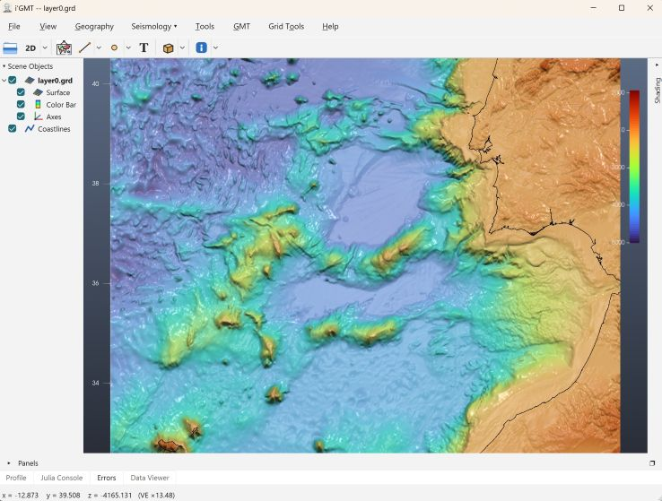

# InteractiveGMT

[](https://www.generic-mapping-tools.org/InteractiveGMT/dev)
[](https://github.com/GenericMappingTools/InteractiveGMT.jl/actions/workflows/Test.yml?query=branch%3Amain)
[](https://codecov.io/gh/GenericMappingTools/InteractiveGMT.jl)
[](https://github.com/GenericMappingTools/InteractiveGMT/actions/workflows/documentation.yml?query=branch%3Amaster)


Interactive 3-D viewing of [GMT.jl](https://github.com/GenericMappingTools/GMT.jl) data —
grids, point clouds, and `GMTfv` solids / polygon meshes — in a **self-contained Qt6 + VTK**
window. Its own Qt window, VTK render pipeline, interaction gizmo, cube
axes, colour bar, shading, vertical curtains, in-window Julia console and data viewer.

## Install

See more extended instructions at [docs for Windows](https://www.generic-mapping-tools.org/GMTjl_doc/documentation/general/install_julia_win.html) but basically, have a GMT.jl updated version and do (works on Windows11, MacOS and Linux)

```julia
using GMT

iGMTinstall()
```

If you do not have Julia, do this:

1- Install Julia:
 - On Windows download https://julialang-s3.julialang.org/bin/winnt/x64/1.10/julia-1.10.12-win64.exe
   - IMPORTANT: Follow recomendations. It must be added to path. Install under `c:\programs\julia.10`
 - On Mac or Linux install it via [juliaup](https://github.com/julialang/juliaup)

2- Open the Julia console (the three colored dots icon) and type `] add GMT`

3- When it finishes (it takes time), hit backscpace and do
```julia
  - using GMT
  - iGMTinstall()
```

At the end of the install process, use `i'GMT` via the desktop icon that was just created

Skip step 1 if you already have Julia installed. Skip points 1 and 2 if you already have [GMT.jl](https://github.com/GenericMappingTools/GMT.jl) installed (but it must be at least the 1.43.2 version)


## See the [Vision](https://www.generic-mapping-tools.org/InteractiveGMT/dev/00-vision) for where this project is headed.

Example of `i'GMT` in action:



## Quick start

Use the `i'GMT` icon that you now have on your desktop. Or, from a Julia REPL

```julia
using InteractiveGMT, GMT
G   = GMT.peaks()
fig = view_grid(G)                 # opens a window, returns a QtFigure handle
```

The call is **non-blocking**: it returns immediately and a Julia `Timer` pumps the Qt loop
(~50 Hz) so the REPL stays usable while the window is open. (In a `julia script.jl` run with no
REPL, end the script with `wait_windows()` to keep the process alive until the window closes.)

## API

| function | shows |
|----------|-------|
| `view_grid(G; …)`   | a `GMTgrid` surface (CPT colour or image `drape`, `vcurtain`, overlays) |
| `view_points(D; …)` | a coloured point cloud (Ctrl+right-drag rubber-band selection) |
| `view_fv(fv; …)` / `view_fv("torus"; …)` | a `GMTfv` solid / named solid / polygon mesh |
| `f3dview(x; …)`     | front-door dispatch over all of the above |
| `add!(fig, D; …)`   | add line/point overlays to a live grid window |
| `add_curtain!(fig, path; …)` | hang a vertical image curtain (seismic / midwater profile) |
| `show_table(fig, D)` | display tabular data in the window's Data Viewer tab |
| `selection(fig)`     | read back the rubber-band-selected point rows |
| `isalive(fig)` · `save_png(path)` · `wait_windows()` | window utilities |

The functions are documented in their docstrings (and, in depth, in `QTVTK_PLAN.md`). Each
overlay/curtain is interactive: right-click for a context menu; the **Scene Objects** dock lists
every element with a show/hide checkbox.

## In-window Julia console

A **Julia Console** dock runs commands straight in the host session (the viewer is in-process),
with `fig` pre-bound to that window — so `add!(fig, [x y z]; mode=:points)` works with no handle
typed. See the docstrings / `QTVTK_PLAN.md` for the C++↔Julia callback mechanism.

## Examples

```julia
include(joinpath(pkgdir(InteractiveGMT), "examples", "solids.jl"))
include(joinpath(pkgdir(InteractiveGMT), "examples", "curtain.jl"))   # needs network (grdcut)
```
