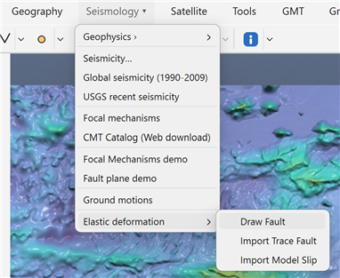
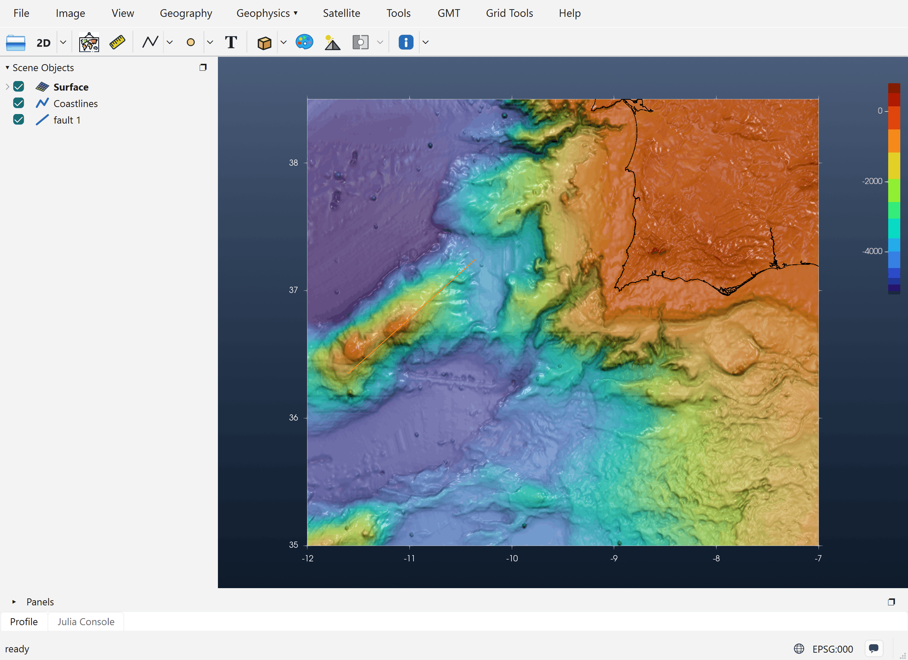
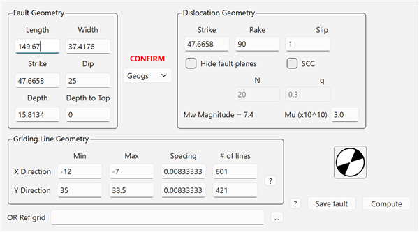
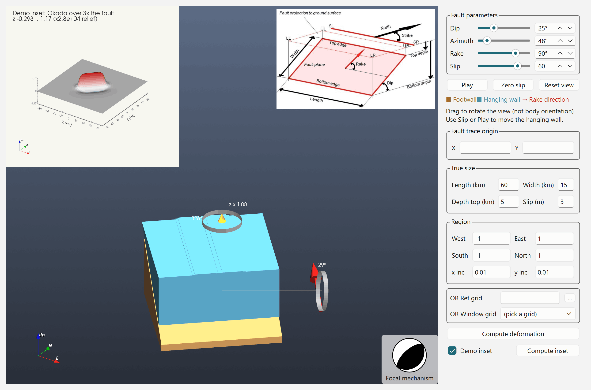
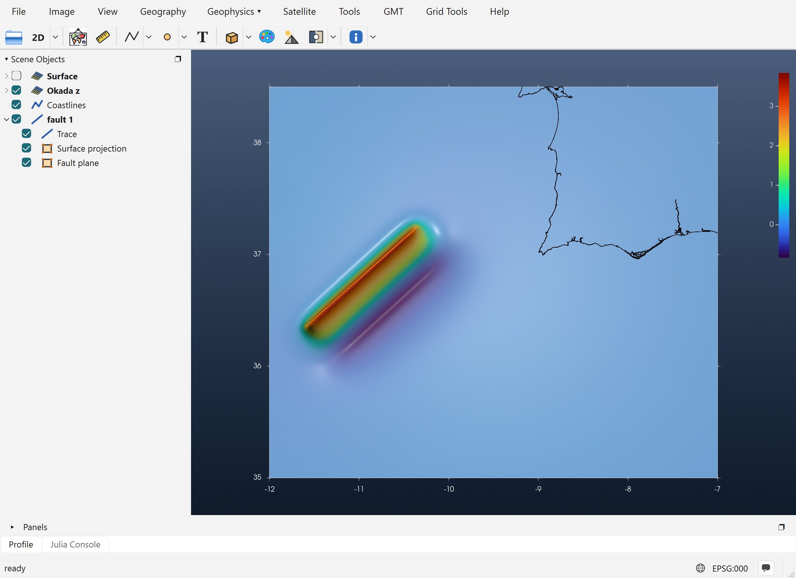
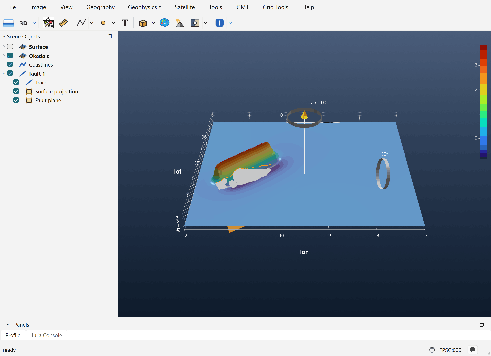

# Tutorial: Elastic Deformation

This tutorial computes the vertical seafloor or ground displacement produced by slip on a
rectangular fault, using Okada's (1985) solution for a dislocation in an elastic half-space. The
result is a new grid, **Okada z**, that can be viewed in 2-D or 3-D and used, for example, as the
initial condition of a tsunami model.

The example below uses a thrust fault along the Gorringe Bank, SW of Portugal, but any place works.

## 1. Load a grid or image in geographic coordinates

The deformation is computed **on a grid**: the grid (or image) in the window supplies the region,
the node spacing and the coordinate system. So start by opening one, with *File → Open* or by
dragging a file onto the window. Coordinates must be **geographic** (longitude/latitude in degrees).
Fault lengths and widths are then entered in kilometres.

Here the grid is `@earth_relief_30s` cut to `-12/-7/35/38.5`, a 601 × 421 grid at 30 arc-seconds.

## 2. Open *Seismology → Elastic deformation*

The submenu has three entries:

- **Draw Fault**: draw a fault trace by hand. This is what this tutorial uses.
- **Import Trace Fault**: read fault traces from a sub-fault-format file. The file gives each fault
  its strike, dip, width, depth, rake and slip, and the dipping plane is drawn right away.
- **Import Model Slip**: read a whole finite-fault slip model (many rectangular sub-faults),
  shown as patches coloured by slip. Its elastic-deformation dialog gets extra *Segments* and
  *Faults* selectors, and **Compute** uses every sub-fault in the model.

## 3. Draw the fault trace

Pick **Draw Fault**, click the start point of the fault, then click its end point (a double-click
ends the line). The trace becomes a **fault 1** row in Scene Objects.

!!! note "The trace is the fault's top edge"
    The line marks the **top edge** of the fault plane, projected to the surface. Which end is the
    first point matters. Strike is measured from the first point to the last, and **the plane dips
    to the right of the strike direction**. Here the line runs from SW to NE (strike ≈ 48°), so the
    plane dips to the SE.

**Right-click** the fault, either the line itself or its row in Scene Objects. Two entries come
first in the menu:

- **Vertical elastic deformation**: the full Okada dialog, described in step 4.
- **Show in Fault plane**: a 3-D model of the fault that shows how dip, azimuth and rake work.
  See step 5.

## 4. The *Vertical elastic deformation* dialog

The dialog opens already filled in from the trace. **Length** and **Strike** are measured on the
line. **Width** starts at Length/4, and **Depth** is derived from the other values. **Griding Line
Geometry** is copied from the window's grid.

### Fault Geometry

| Field | Meaning | Effect on the deformation |
|---|---|---|
| **Length** (km) | Along-strike length of the fault | The length of the deformed zone. Editing it moves the end of the trace on the map. |
| **Width** (km) | Down-dip width of the plane | A wider fault moves more rock, and the uplift spreads farther down-dip. |
| **Strike** (°) | Azimuth of the trace, clockwise from North | Rotates the whole pattern. Editing it swings the trace around its first point. |
| **Dip** (°) | Angle of the plane below horizontal | A shallow thrust gives a broad uplift with a shallow trough behind it. A steep one gives a narrower, more symmetric uplift and trough. |
| **Depth** (km) | Depth of the bottom edge | Read-only in practice: always recomputed as *Depth to Top + Width · sin(Dip)*. |
| **Depth to Top** (km) | Depth of the top edge below the surface | 0 means the fault breaks the surface, which gives a sharp step at the trace. Deeper faults give a smaller, smoother and wider signal. |

The **gray patch** drawn beside the trace is the plane's projection onto the surface. In 3-D view,
the buried dipping plane itself is also drawn. Both follow the Width, Dip and Strike fields as you
type.

### Dislocation Geometry

| Field | Meaning | Effect on the deformation |
|---|---|---|
| **Strike** | The dislocation strike. It stays equal to the fault strike. | See above. |
| **Rake** (°) | Direction of slip on the plane (Aki & Richards convention) | **90**: thrust. The hanging wall goes up, giving uplift above the fault and a smaller trough farther down-dip. **−90**: normal fault, the same pattern with the sign reversed. **0 / 180**: strike-slip, which moves the ground mostly sideways and gives only a small four-lobed vertical pattern. Values in between mix the two. |
| **Slip** (m) | Amount of slip on the plane | The field is **linear** in slip: doubling slip doubles every value. |
| **Mu** (×10¹⁰ Pa) | Shear modulus (rigidity) | Used **only for the magnitude**, not for the displacement. |
| **Mw Magnitude** | Updates as you type | *M₀ = μ · L · W · slip*, *Mw = ⅔ log₁₀ M₀ − 6.07*. |

**Hide fault planes**, **SCC**, **N** and **q** are carried over from Mirone's dialog. The current
computation does not use them.

The **beachball** shows the focal mechanism for the current Strike, Dip and Rake. Click it to open
*Focal Meca Studio* with the same values.

**CONFIRM** sets the coordinate type: **Geogs** for longitude/latitude, **Cart** for Cartesian.
It is chosen automatically from the grid. Check it before computing.

### Where the deformation is computed

**Griding Line Geometry** shows the region, spacing and size of the window's grid. When the window
has a grid, the deformation is always computed **on that grid's own nodes**: same size, same
registration, same coordinates. The result can then be added to the bathymetry node by node.

### Buttons

- **Compute** runs Okada and adds the result to the window (step 6).
- **Save fault** writes the fault in sub-fault format. *Import Trace Fault* can read it back.

For this example the dialog values were changed to **Depth to Top = 5 km** and **Slip = 8 m**,
with rake 90° (a thrust) and dip 25°.

## 5. Alternative: *Show in Fault plane*

**Show in Fault plane** opens the *Fault plane demo*, a 3-D block model of the fault that helps
you picture the parameters before computing anything.

When it is opened from a drawn trace, the demo is filled in from that trace:

- **Azimuth** is set to the trace's strike.
- **True size → Length** is the trace length, and **Width** starts at Length/4, the same rule the
  elastic dialog uses.
- **Fault trace origin X/Y** is the trace's first point, so the computed deformation lands exactly
  where you drew the line.
- **Region** is taken from the window's grid.

(The screenshot above shows the demo opened on its own from *Seismology → Fault plane demo*, so it
still has the default values.)

The controls:

- **Dip, Azimuth, Rake** (sliders) turn and tilt the model. The **Footwall** is drawn in brown and
  the **Hanging wall** in blue. The red arrow shows the rake direction, and the beachball follows
  the mechanism.
- **Slip** (slider) moves the hanging wall along the rake so you can watch the motion. This slider
  only animates the model: ±100 corresponds to ±30 % of the block length. **Play** animates it,
  **Zero slip** puts the block back, and **Reset view** resets the camera.
- **True size** (Length, Width, Depth top, Slip in m) holds the fault's **real** dimensions. Only
  the Okada computation uses them. The block model stays the same size whatever you type.
- **Region / OR Ref grid / OR Window grid** set where the deformation is computed.
- **Compute deformation** computes the Okada field for the true size and puts it into the window
  the demo was opened from, the same way the elastic dialog's **Compute** does.
- **Demo inset** / **Compute inset** show a small preview in the top-left corner: the Okada field
  over a zone three times the size of the fault, centred on it. Nothing is added to the main window.

Try moving **Rake** from 90° to −90° and pressing **Compute inset**: the uplift becomes subsidence.
Then set **Dip** to 60° and compare how narrow the pattern gets.

## 6. The result in 2-D

After **Compute**, a new grid named **Okada z** appears in Scene Objects. Its values are vertical
displacement in metres. The new grid is checked (visible), the source grid is unchecked, and the
axes and colour bar are set to the new grid's own values.

For this 8 m thrust the maximum uplift is about 3.7 m, at the trace. The uplift decreases toward
the SE, over the buried plane. Farther down-dip there is a trough of about −0.9 m, and the footwall
side (NW) barely moves. The **fault 1** group now has three rows: the **Trace**, its **Surface
projection** and the buried **Fault plane**.

## 7. The result in 3-D

Switch the **2D** toolbar button to **3D** and rotate the view with the mouse or the gizmo. The
vertical-exaggeration handle (*z × …*) makes small displacements easier to see.

The ridge of uplift along the fault and the trough behind it are now visible in relief. The buried
fault plane lies under the surface. Uncheck **Surface projection** in Scene Objects if the gray
patch hides the deformation.

## Next steps

- To model a tsunami, add **Okada z** to the bathymetry, or pass it to NSWING as the initial
  condition. It is on exactly the same nodes as the grid it was computed from, so the two add
  node by node.
- Use **Save fault** to keep the fault, and **Import Trace Fault** to load it again later.
- For a real earthquake, use **Import Model Slip** to compute the deformation from a published
  finite-fault model.
