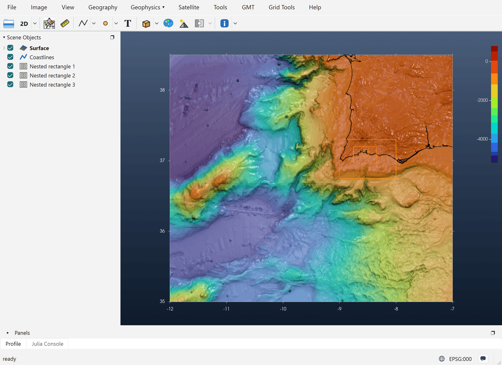
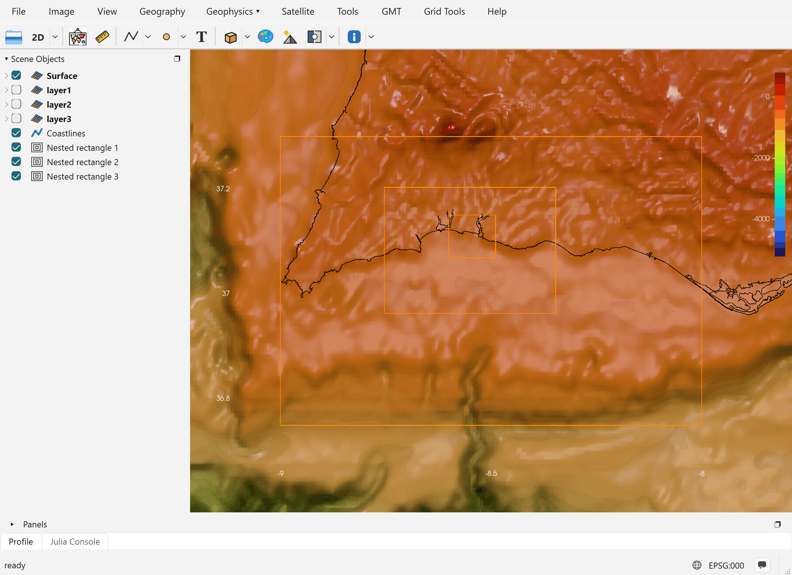
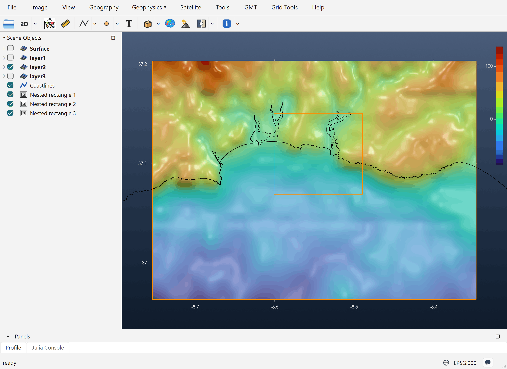

# Tutorial: Nested Grids

A tsunami model such as NSWING (or COMCOT) runs on a chain of **nested grids**. A coarse grid
covers the whole ocean basin where the wave travels. Each finer grid inside it covers a smaller
area near the coast, where the wave shortens and the bathymetry needs more detail. The grids pass
the wave to each other along their borders, so they have to line up exactly. Each child grid must
tile its parent's cells with no offset. A child that is off by even part of a cell makes the
model fail its nesting check.

The **Nested grids** tool draws rectangles that obey this rule by construction. You draw roughly
where you want each level, and every rectangle snaps to its parent's nodes on its own.

The example builds three levels toward the harbour of Portimão, on the south coast of Portugal.

!!! tip "Compute the deformation in the same window"
    A tsunami run needs two things: the nested grids, and the initial sea-surface deformation
    (*Okada z*), which is its **Source**. NSWING takes both from **one iGMT window**. So compute the
    deformation alongside the nesting, **in the same window and on the same bathymetry**: draw the
    fault and run *Vertical elastic deformation* there, before or after the rectangles. The
    [Elastic Deformation tutorial](62-elastic-deformation.md) explains how. The deformation is then
    computed on the bathymetry's own nodes, so the two line up node for node and are both ready
    when NSWING opens.

## 1. Load the bathymetry

Open the bathymetry grid that covers the whole model area (*File → Open*, or drag the file onto
the window). This grid is the root of the chain: NSWING calls it **layer0**. Here it is
`@earth_relief_30s` over `-12/-7/35/38.5`, 601 × 421 nodes at 30″ (about 900 m). The coastline
(*Geography → Plot coastline*) is added to make the figures easier to read.

## 2. Draw the first rectangle

In the **Geophysics** menu, switch to the **Tsunamis** discipline (*Geophysics › → Tsunamis*),
then pick **Nested grids**. The same tool is also in the toolbar's shapes flyout. Click one corner
of the area, then the opposite corner.

The rectangle does not stay exactly where you clicked. Each edge moves to the nearest node of the
parent grid. The **first** rectangle keeps the base grid's cell size (30″ here). It marks the part
of the bathymetry that the chain starts from.

## 3. Add finer levels: *New nested grid*

Right-click the rectangle, either in the view or on its row in Scene Objects. Nested rectangles
have their own menu:

| Entry | What it does |
|---|---|
| **Show nesting info** | The level's `-R`/`-I`, its size, and where it starts and ends in the parent grid (see below). |
| **Create blank grid** | Makes the grid for this level (step 5). |
| **New nested grid** | Adds a finer child inside the **innermost** rectangle of the chain. |
| **Rectangle limits (edit)…** | Type the W/E/S/N limits instead of dragging. |
| **Save rectangle…** | Writes the corner coordinates to a file. |

**New nested grid** asks for a **refinement factor** (default 5). The child's cell size is the
parent's divided by that factor, and it first appears over the inner half of the parent. Drag its
vertices, or use *Rectangle limits (edit)…*, to move it where you want it. It snaps back onto the
parent's nodes every time. Run **New nested grid** again for the next level, and so on.

For this example the factor was 5 both times:

| Level | Rectangle | Cell size | Size |
|---|---|---|---|
| layer0 (base) | −12 / −7 / 35 / 38.5 | 30″ ≈ 900 m | 601 × 421 |
| layer1 | −9.00 / −8.00 / 36.75 / 37.30 | 30″ ≈ 900 m | 121 × 67 |
| layer2 | −8.753 / −8.347 / 36.963 / 37.203 | 6″ ≈ 180 m | 245 × 145 |
| layer3 | −8.601 / −8.489 / 37.069 / 37.151 | 1.2″ ≈ 36 m | 335 × 245 |



### How the snapping works

Every edge of a child goes to the **nearest parent node**. It is then moved half a parent cell
outward and half a child cell inward:

```
west  = parent node − parent_inc/2 + child_inc/2
east  = parent node + parent_inc/2 − child_inc/2
```

and the same for south and north. The child's nodes then sit at the centres of sub-cells of the
parent's cells, which is what NSWING's nesting check expects. That is why layer2's west edge is
−8.75333 and not the −8.75 that was drawn: −8.75 is a layer1 node, minus half a 30″ cell, plus half
a 6″ cell.

The chain follows the order the rectangles were created in. The first rectangle's parent is the
base grid, and every later rectangle's parent is the one made just before it. This decides what
happens when you edit the chain:

- **Moving or resizing a rectangle** re-snaps that rectangle and every rectangle **inside** it.
  Its parents never move.
- **Deleting a rectangle** also deletes every rectangle inside it, together with their grids.

### Show nesting info

For layer2 of this example, **Show nesting info** gives:

```
-R-8.75333333333/-8.34666666667/36.9633333333/37.2033333333 -I0.00166666666667/0.00166666666667
nx = 245   ny = 145
x_start = 31
x_end = 79
y_start = 27
y_end = 55
```

`x_start … y_end` are the parent's (layer1's) node indices, counted from 1, where this level
begins and ends. These are the numbers a COMCOT-style set-up file asks for.

## 4. Create the grids: *Create blank grid*

Run **Create blank grid** on each rectangle (right-click on the rectangle line to see this option).
It makes an all-zero grid with exactly that rectangle's limits and cell size and adds it to the
**same window** as **layer1**, **layer2**,
**layer3**. The names follow the chain order. The new rows start **unchecked** (hidden), because
the grids hold no data yet.



## 5. Fill the grids with bathymetry: *Transplant 2nd grid…*

Right-click a **layerN** row in Scene Objects and pick **Transplant 2nd grid…**. The dialog lists
the grids already in the window that can fill this level. A grid is listed only if it uses the
same kind of coordinates and **completely covers** the rectangle. Deformation grids (*Okada z*) and
the other nested levels are never listed. **External file…** picks a grid from disk instead.

The source is sampled onto the level's own nodes. The grid is then filled with real depths, and it
is shown with its own colour scale and axes.



!!! note "Use the best bathymetry you have for the inner levels"
    In this example every level is filled from the same 30″ grid, so layer2 and layer3 only
    **interpolate** it: they have more nodes but no new detail. For a real study, fill each finer
    level from higher-resolution data such as multibeam surveys, EMODnet or a local DEM, with
    *External file…*. That is the reason for nesting in the first place.

If you move or resize a rectangle **after** filling its grid, run *Transplant 2nd grid…* again.
The level is rebuilt at the rectangle's **new** size and refilled.

## 6. Run the model

Open *Tsunamis → NSWING tsunami…*. The bathymetry (layer0) and the **layer1…layerN** grids of the
window are the model's nesting chain, and the *Okada z* grid computed in the same window is picked
as the **Source**. Before running, NSWING checks that:

- no level is still blank (all zero);
- every level fits inside its parent and sits on the parent's nodes, as explained above.

When it runs, NSWING writes the levels to disk as `layer1.grd`, `layer2.grd`, …. A level opened
from such a file keeps its link to its rectangle, so it can still be refilled.

## 7. Save the session, and save it often

Building a model is a lot of work: the bathymetry, the fault, the deformation, the rectangles and
their filled grids. **It is extremely recommended to save it as a session** with *File → Save
Session…* (an `.igmtz` file). Save again after each important step, for example after drawing the
rectangles, after filling the grids, and after computing the deformation.

*File → Load Session…* brings the window back as it was, with its contents and the work done so
far. You can then carry on or change something (move a rectangle, try another slip) without
building everything again. If iGMT or the Julia session closes, a saved session is what you keep.

See also the [Catalina Benchmark 1](80-benchmark1.md), which runs NSWING on a three-level chain.
