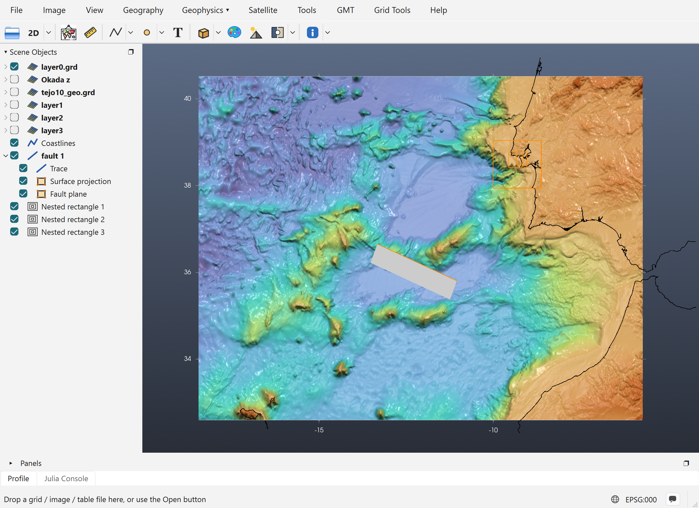
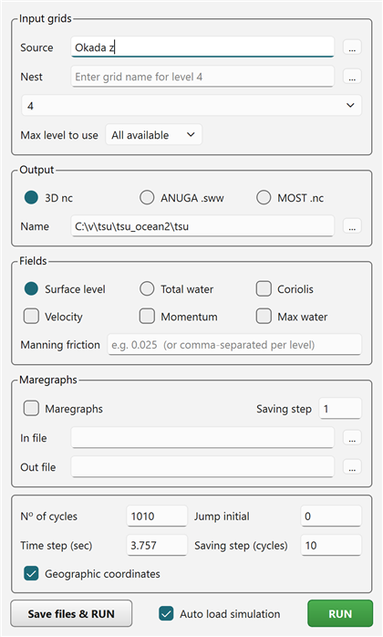

# Tutorial: Running NSWING

NSWING is the tsunami propagation and inundation model that comes with GMT. It solves the
shallow-water equations on a chain of nested grids. iGMT runs it **in-process**: it takes the grids
straight from the window, shows a progress bar while it runs, and opens the result in the Aquamoto
viewer when it finishes.

This tutorial uses a real set-up: a thrust source SW of Cape São Vicente, with the wave followed
into the Tejo estuary and Lisbon.

## 1. What the window must hold

NSWING takes everything from **one iGMT window**:

| Role | Grid in the window | How to get it |
|---|---|---|
| Bathymetry (layer0) | the base grid, here `layer0.grd` (2′, −18.45/−5.72/32.6/40.52) | *File → Open* |
| Source (initial sea surface) | **Okada z** | [Elastic Deformation tutorial](62-elastic-deformation.md) |
| Nested levels | **layer1**, **layer2**, **layer3** | [Nested Grids tutorial](64-nested-grids.md) |

In this example the levels have cells of 12″, 2.4″ and 0.48″ (about 370 m, 74 m and 15 m), and
they were filled from a 10 m model of the Tejo estuary (`tejo10_geo.grd`).



!!! tip "Save the session first"
    A set-up like this takes a lot of work. Save it with *File → Save Session…* before you run
    anything. The window shown here was loaded from such a session.

## 2. Open the NSWING dialog

In the **Geophysics** menu, switch to the **Tsunamis** discipline (*Geophysics › → Tsunamis*),
then pick **NSWING tsunami…**. The dialog does not block the window. It stays open across any
number of runs until you close it. Minimising it parks it as a row in Scene Objects, and a
double-click on that row brings it back.



Most of it is already filled in from the window, as described below.

## 3. Input grids

- **Source** is set to the window's **Okada z** grid. The **...** button picks a source grid file
  instead.
- **Nest** and the level list below it hold the nesting chain. Each filled **layerN** of the window
  shows up as *"N -- level ready to use"*. The list then opens on the next **free** level (4 here),
  where you can add one more level from a file. A nest file typed or picked here is checked
  against its parent **at once**. If it breaks the nesting rule, a message gives the corner values
  it should have.
- **Max level to use** limits how deep a run goes. *level 1* runs only the bathymetry and layer1,
  which is a quick way to test the set-up before paying for the finest grid. The default is
  *All available*.

## 4. Output

- **3D nc** writes the whole simulation to **one 3-D netCDF file**, with one slice per saving step.
  This is the format the Aquamoto viewer opens.
- **ANUGA .sww** writes ANUGA's netCDF format instead.
- **MOST .nc** is not supported by the NSWING version that ships with GMT. Choosing it gives an
  error.
- **Name** is the **full path** of the output file. Use the **...** button to choose where it goes.

### Fields

Fields can only be set for the *3D nc* output.

| Option | What it writes |
|---|---|
| **Surface level** / **Total water** | The sea-surface height, or the total water depth. |
| **Max water** | An extra grid with the **maximum** water level reached at each node over the whole run: the usual inundation and hazard map. |
| **Velocity** | Velocity grids (suffixes `_U`, `_V`). |
| **Momentum** | Momentum grids. |
| **Coriolis** | Adds the Coriolis effect to the equations. Only worth it for long propagation distances. |
| **Manning friction** | Bottom friction coefficient, e.g. `0.025`. One value for all levels, or comma-separated values, one per level. |

## 5. Maregraphs (virtual tide gauges)

Tick **Maregraphs** to record the water height through time at chosen points. **In file** is a
plain text file with one `lon lat` pair per line, for example:

```
-9.27 38.63
-9.20 38.685
-9.16 38.69
```

These three points are off Costa da Caparica, in the Tejo channel at Belém, and on the Lisbon
waterfront. Put gauges **in the water** and inside the finest grid that covers them. **Out file**
receives the time series. **Saving step** records one sample every that many time steps.

## 6. Run parameters

| Field | Meaning |
|---|---|
| **Time step (sec)** | The model time step. It is **prefilled** with a stability (CFL) estimate from the bathymetry: *Δt = Δx / √(g·\|z_min\|) / 2*, with Δx in metres. Here it is 3.757 s for the 2′ grid with a deepest point of about 6.2 km. Increasing it can make the run unstable. |
| **Nº of cycles** | How many time steps to run. **Simulated time = cycles × time step**: 1010 × 3.757 s ≈ 63 minutes, enough for the wave to reach Lisbon from this source. |
| **Saving step (cycles)** | Write a slice every that many cycles. 10 gives 1010 / 10 = 101 slices, one every 37.6 s of model time. |
| **Jump initial** | Write nothing before this model time, in seconds. Useful when the first part of the run, before the wave reaches the area of interest, is not needed. |
| **Geographic coordinates** | Ticked automatically when the grids are longitude/latitude. |

The run's cost grows with the number of nodes in the finest levels, and those levels also need
shorter internal time steps. With a 0.48″ level of 1595 × 1480 nodes, a run takes a long time. To
test the set-up, use **Max level to use** or fewer cycles first.

## 7. Run

**RUN** first checks the set-up and stops with a message if something is wrong:

- no Source grid;
- a level that is still **blank** (all zeros; fill it with *Transplant 2nd grid…*);
- a level that does not nest in its parent.

It then starts NSWING in the background. A progress bar shows how far the run has got, and the
window stays usable. **Save files & RUN** does the same with files on disk. It writes the
bathymetry, the source and every level to a folder you choose, then either shows the equivalent
`gmt nswing …` command line or runs it as a separate process. Use it to keep a run that can be
repeated outside iGMT.

When **Auto load simulation** is ticked (the default), the finished 3-D netCDF opens in a **new**
iGMT window in the **Aquamoto** viewer, where you can step through the slices, animate them and
look at the maximum water level.

## Related tutorials

- [Elastic Deformation](62-elastic-deformation.md): making the Source.
- [Nested Grids](64-nested-grids.md): making the levels.
- [Catalina Benchmark 1](80-benchmark1.md): an NSWING run checked against an analytical solution.
