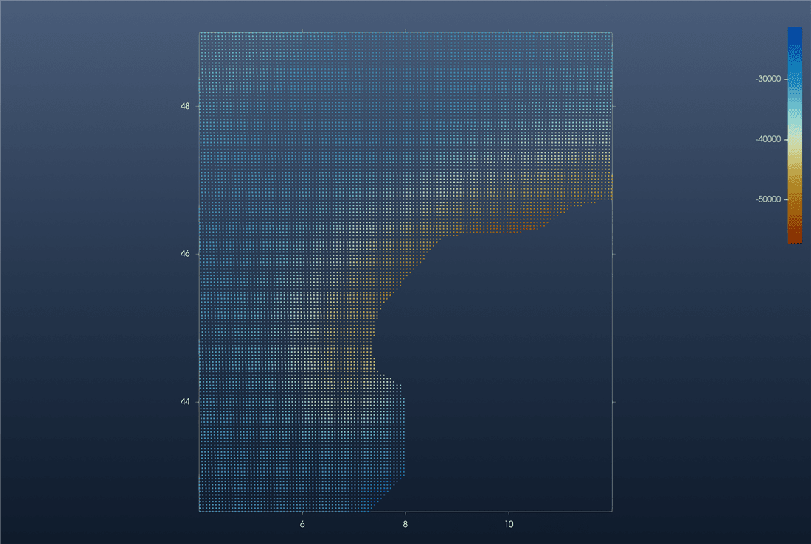
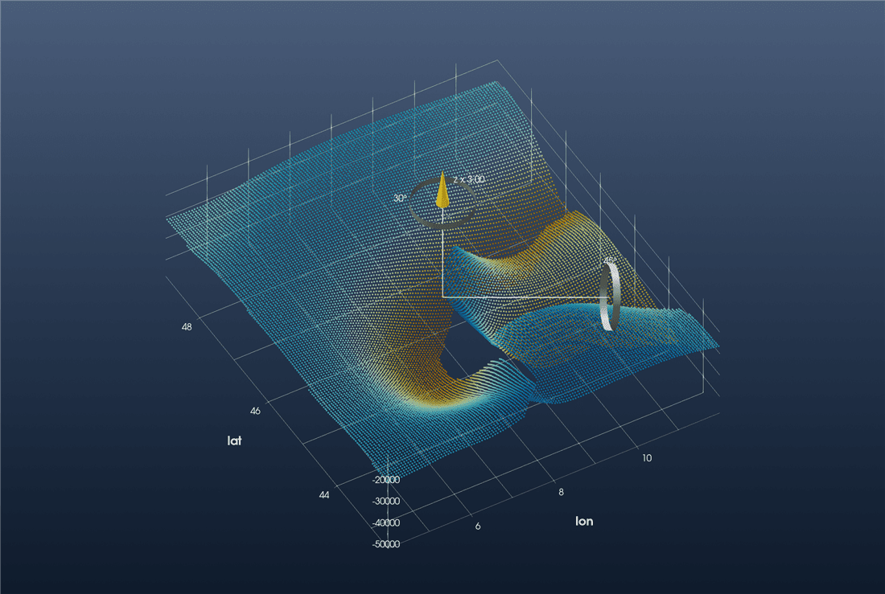
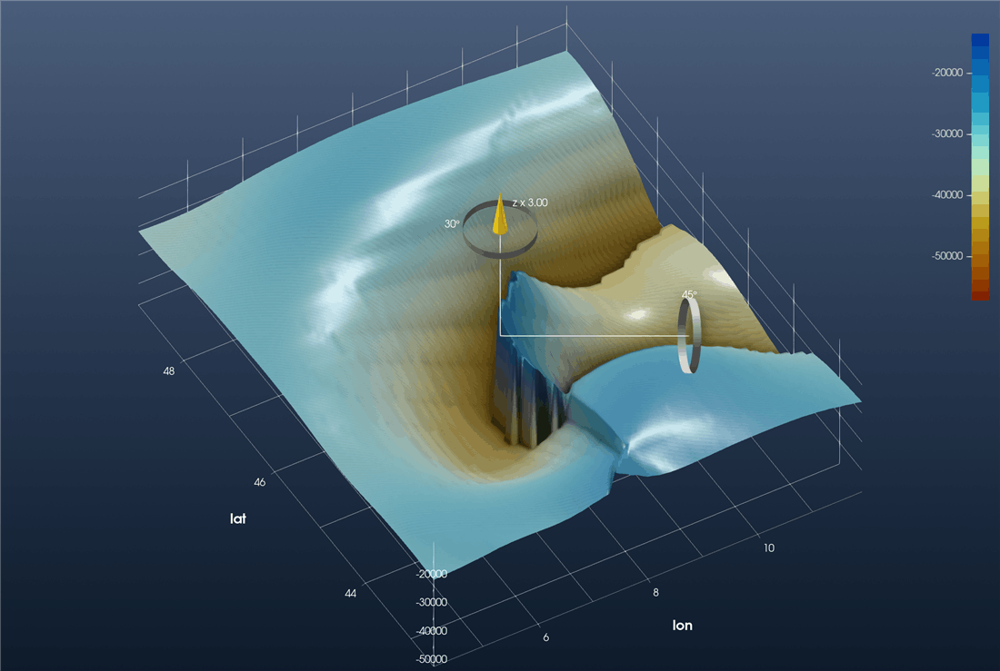

```@meta
CurrentModule = InteractiveGMT
```

# Tutorial: Moho Topography (Spada et al., 2013)

This is the GeophysicalModelGenerator.jl tutorial
[*Visualize Moho topography*](https://juliageodynamics.github.io/GeophysicalModelGenerator.jl/dev/man/Tutorial_MohoTopo_Spada/)
redone with iGMT and plain GMT.jl commands: no ParaView, no Plots.jl.

The data are the three Moho surfaces of the western Alps and Italy of

> Spada, M., I. Bianchi, E. Kissling, N. Piana Agostinetti and S. Wiemer (2013). Combining
> controlled-source seismology and receiver function information to derive 3-D Moho topography
> for Italy. *Geophysical Journal International*, 194(2), 1050–1068.

`Moho1` is the European Moho, `Moho2` the Adriatic and `Moho3` the Tyrrhenian–Corsica one.

## 1. Read the data

Each file has 38 `#` comment lines, then `longitude latitude depth` rows, with depth in
kilometres, positive down. `gmtread` skips the comments, and GMT's `incols` scales the depth
column on the way in: `2+s-1000` turns it into an elevation in **metres**, the unit iGMT expects
for z over longitude/latitude.

```julia
using InteractiveGMT, GMT

url = "https://seafile.rlp.net/d/a50881f45aa34cdeb3c0/files/?p=%2FMoho_Map_Data-WesternAlps-SpadaETAL2013_Moho"

Moho1 = gmtread(download(url * "1.txt&dl=1"), data=true, incols="0,1,2+s-1000")
Moho2 = gmtread(download(url * "2.txt&dl=1"), data=true, incols="0,1,2+s-1000")
Moho3 = gmtread(download(url * "3.txt&dl=1"), data=true, incols="0,1,2+s-1000")
```

## 2. The European Moho as a map

```julia
iview(Moho1; cmap=:roma, geographic=true)
```

The points form a 3-D cloud coloured by z. Pick **2D** on the toolbar to look straight down.
This is GMG's first figure, a scatter plot coloured by depth, with a colour bar:



## 3. The three Mohos in 3-D

`iview` takes the three tables together:

```julia
iview([Moho1, Moho2, Moho3]; cmap=:roma, geographic=true)
```

Tilt the view with the mouse and raise the vertical exaggeration with the gizmo's blue ring
(or *View → Vertical Exaggeration…*). This view is at ×3:



This is GMG's ParaView figure of the three point files, with the hole in the middle where no
Moho is defined and the steps where one surface meets another.

## 4. One regular Moho grid

GMG grids the three sets together on `4.1:0.1:11.9 × 42.5:0.1:49`. Each node takes the depth of
its nearest data point. GMT's `nearneighbor` does exactly that with one sector (`N=1`). Its
search radius just has to be wide enough to fill every node:

```julia
G = nearneighbor([Moho1, Moho2, Moho3], region=(4.1, 11.9, 42.5, 49), inc=0.1,
                 search_radius="1000k", N=1, f="g")
iview(G; cmap=:roma)
```

`G` has the same 79 × 66 nodes as GMG's grid. Switch to **3D** and set the exaggeration as before:



This is GMG's final figure. Where the Adriatic Moho overrides the European one, the nearest-point
grid jumps from one surface to the other. That step is the Moho offset described in the paper.

Keep the grid with

```julia
gmtwrite("Spada_Moho_combined.grd", G)
```

or with *File → Save Grid…* in the window.
