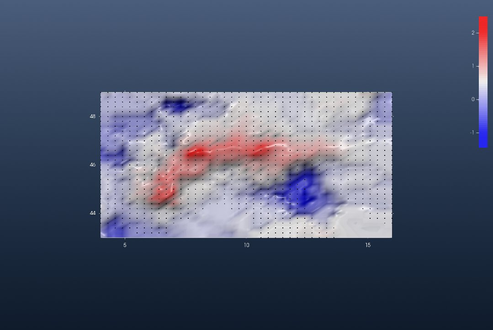
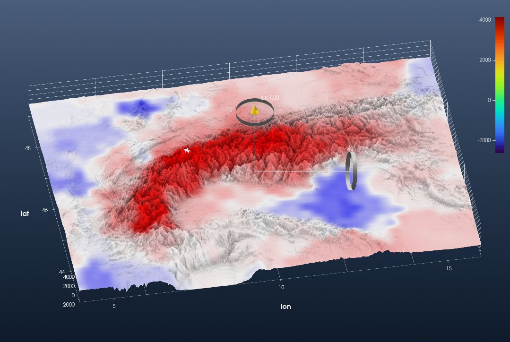
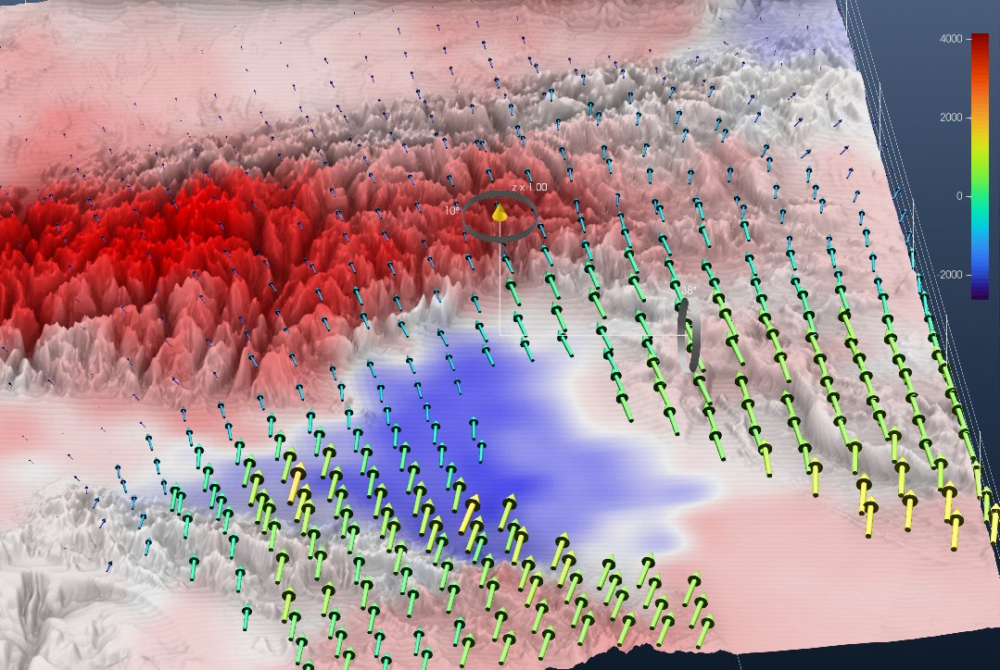

```@meta
CurrentModule = InteractiveGMT
```

# Tutorial: GPS Velocities of the Alps (Sánchez et al., 2018)

This is the GeophysicalModelGenerator.jl tutorial
[*Plotting GPS Vectors*](https://juliageodynamics.github.io/GeophysicalModelGenerator.jl/dev/man/tutorial_GPS/)
redone with iGMT and plain GMT.jl commands: no CSV.jl, no Interpolations.jl, no ParaView.

The data are the surface deformation model of the Alpine region of

> Sánchez, L., C. Völksen, A. Sokolov, H. Arenz and F. Seitz (2018). Present-day surface deformation
> of the Alpine region inferred from geodetic techniques. *Earth System Science Data*, 10, 1503–1526.
> Data: [doi:10.1594/PANGAEA.886889](https://doi.pangaea.de/10.1594/PANGAEA.886889)

There are two files:

- `ALPS2017_DEF_VT.GRD` holds the **vertical** velocity on a regular 0.3° × 0.2° grid over
  4–16° E, 43–49° N.
- `ALPS2017_DEF_HZ.GRD` holds the **horizontal** (east, north) velocity, only at the nodes on land.

Velocities are in m/yr.

## 1. Read the data

Both files start with 17 lines of text: the title, the authors, and a description of the columns.
The data rows follow. GMT's `h=17` skips that header. `incols` keeps the columns we need and scales
the velocities to **mm/yr** on the way in (`+s1000`). GMG does these three steps with `CSV.File`,
`parse_columns_CSV` and a `*1000`.

```julia
using InteractiveGMT, GMT

url = "https://store.pangaea.de/Publications/Sanchez-etal_2018/ALPS2017_DEF_"

Vz = gmtread(url * "VT.GRD", data=true, h=17, incols="0,1,2+s1000")          # lon lat Vz
Vh = gmtread(url * "HZ.GRD", data=true, h=17, incols="0,1,2+s1000,3+s1000")   # lon lat Ve Vn
```

`Vz` has 1271 rows, one per node of the 41 × 31 grid. `Vh` has 1111 rows: the same grid, minus the
160 nodes at sea.

## 2. The vertical velocity as a grid, and where the horizontal stations are

GMG reshapes the columns into 41 × 31 arrays. Because the points are the nodes of a regular grid,
`xyz2grd` turns them into a real `GMTgrid` directly:

```julia
Gvz = xyz2grd(Vz, region=(4, 16, 43, 49), inc=(0.3, 0.2))

iview(Gvz; cmap=:polar, data=Vh.data[:, 1:2], mode=:points, data_color=:black, data_size=4)
```

The `data=` keyword overlays the positions of the horizontal-velocity nodes as black points. This
one view is GMG's first two scatter plots: the full grid of vertical velocities, and the
horizontal nodes that stop at the coast:



Uplift (red, up to 2.5 mm/yr) follows the arc of the Alps. The Po plain and the northern Adriatic
subside (blue).

For the horizontal field, GMG fills a NaN array node by node with a search loop. `xyz2grd` does the
same thing: a node with no data stays NaN. Keep these two grids if you want *GMT → grdvector* later:

```julia
Gve = xyz2grd(Vh[:, [1, 2, 3]], region=(4, 16, 43, 49), inc=(0.3, 0.2))    # east,  NaN at sea
Gvn = xyz2grd(Vh[:, [1, 2, 4]], region=(4, 16, 43, 49), inc=(0.3, 0.2))    # north, NaN at sea
for G in (Gve, Gvn)
	G.proj4 = "+proj=longlat +datum=WGS84 +no_defs"     # they are lon/lat
end
```

The last line matters if you write these grids to disk. `xyz2grd` labels its output `"+xy"`, and
`gmtwrite` currently fails on that label with *"Failed to initialize SRS based on PROJ4 string"*.

## 3. Vertical velocity on the topography

GMG interpolates the elevation onto the GPS nodes and shows the velocity grid bent over the relief.
iGMT goes the other way: it keeps the full-resolution topography and paints the velocity on it as
a draped image. `grdsample` brings `Gvz` to the 1′ spacing of the DEM, and `grdimage` with
`img_out=true` returns it coloured, as a `GMTimage`, instead of plotting it:

```julia
topo = grdcut("@earth_relief_01m", region=(4, 16, 43, 49))

Cvz  = makecpt(cmap=:polar, range=(-2.5, 2.5))                                 # mm/yr, white = 0
Ivz  = grdimage(grdsample(Gvz, region=(4, 16, 43, 49), inc="1m"), cmap=Cvz, img_out=true)

fig = iview(topo; drape=Ivz)
```

Switch to **3D** on the toolbar and turn the view with the gizmo. The colour bar is the
elevation's. The drape uses `Cvz`: blue −2.5, white 0, red +2.5 mm/yr.



This is GMG's third figure. The uplift follows the high ground. It peaks at 2.5 mm/yr in the
central Swiss Alps (8.2° E, 46.6° N) and is about 1.9 mm/yr at Mont Blanc.

## 4. The horizontal velocity vectors

In ParaView, GMG draws the vectors with the *Glyph* filter. In iGMT, a table of `x y u v` rows is
an **arrow field**. Write the horizontal table out:

```julia
gmtwrite("ALPS2017_Vh_mm_yr.txt", Vh)
```

Then in the same window, choose *File → Open xy(z) → Import Arrow field* and pick that file. Each
vector becomes a **solid 3-D arrow**: a shaft and a cone, the same glyph as the *Fault plane demo*,
and the same kind of glyph GMG draws with ParaView's *Glyph* filter.

- **Length:** scaled by magnitude, so the longest arrow is 0.9 of the station spacing.
- **Colour:** by magnitude.
- **Position:** each arrow stands on the highest relief under its own length, so it is not buried in
  the slope it crosses.

The whole field is **one** row in *Scene Objects*. Right-click it and open *Arrow properties* to:

- pick another colormap (*Colour by magnitude…*; the figure uses `viridis`, which reads better than
  the default `jet` over the red and blue velocity drape);
- paint the field in one *Single colour…*;
- stretch or shrink it with *Arrow length…*.

In a flat 2-D view the arrows become flat arrow shapes, and on the globe they follow the local east
and north.



This is GMG's last figure, seen here over the eastern Alps. The arrows are nearly still in the
west. Towards the south-east they grow and turn north: this is Adria pushing into the Alps, at up
to 3.3 mm/yr relative to stable Europe.

The same field can also come from the two grids of step 2. Save them with
`gmtwrite("Ve.grd", Gve)` and `gmtwrite("Vn.grd", Gvn)`, then open *GMT → grdvector* and name them
as the two components. That dialog adds grdvector's own controls: node spacing, scale, and colour by
magnitude. It draws the same solid arrows by default. Untick *Solid 3-D arrows* to get GMT-style line
arrows with the head options instead.
