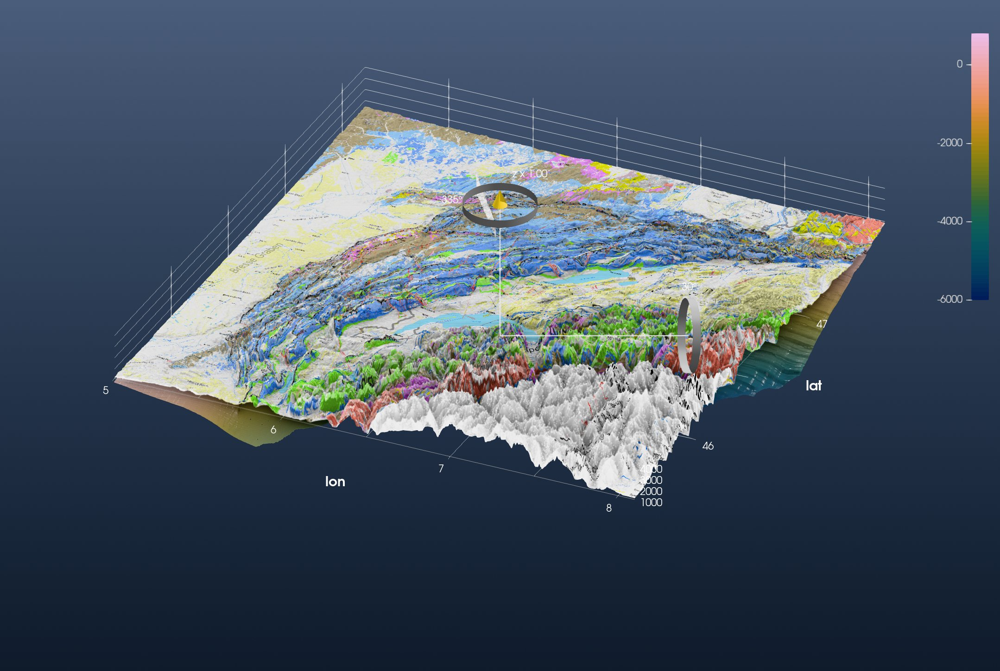
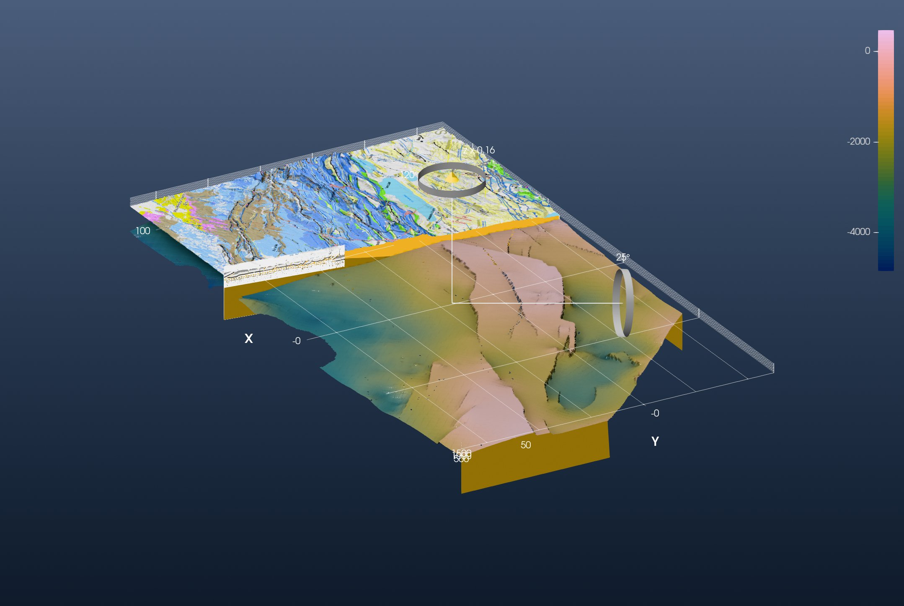

```@meta
CurrentModule = InteractiveGMT
```

# Tutorial: A 3-D Model of the Jura Mountains

This is the GeophysicalModelGenerator.jl tutorial
[*Jura Tutorial*](https://juliageodynamics.github.io/GeophysicalModelGenerator.jl/dev/man/Tutorial_Jura/)
redone with iGMT and plain GMT.jl commands: no GMG, no ParaView.

It puts four things in one scene: a geological map draped over the topography, the depth of the
basement below it, a geological cross-section, and a block model cut open along that section. The
data are Schori's (2020) map and basement surface of the Jura, on Zenodo
([10726801](https://zenodo.org/records/10726801)).

## 1. Load the data

The topography is GMT's own 3″ earth relief over the Jura:

```julia
using GMT, InteractiveGMT

Topo = grdcut("@earth_relief_03s", region=(5, 8.1, 45.5, 47.7))
```

The geological map is a picture with no coordinates. GMG gives it its corner coordinates with
`screenshot_to_GeoData`. GDAL's `-a_ullr` does the same: it stamps the picture's upper-left and
lower-right corners, in degrees:

```julia
z = "https://zenodo.org/records/10726801/files/"
download(z * "SchoriM_Encl_01_Jura-map_A1.png", "SchoriM_Encl_01_Jura-map_A1.png")

Geology = gdaltranslate("SchoriM_Encl_01_Jura-map_A1.png",
                        "-a_ullr 4.54602510460251 47.781282316442606 8.948117154811715 45.27456049638056 -a_srs EPSG:4326")
```

The basement surface is a GeoTIFF, already in longitude and latitude, with depths in metres:

```julia
download(z * "BMes_Spline_longlat.tif", "BMes_Spline_longlat.tif")
Basement = grdcut("BMes_Spline_longlat.tif", region=(5, 8.1, 45.5, 47.7))
```

The cross-section is a picture too:

```julia
download(z * "Schori_2020_Ornans-Miserey-v2_whiteBG.png", "Schori_2020_Ornans-Miserey-v2_whiteBG.png")
Section = gmtread("Schori_2020_Ornans-Miserey-v2_whiteBG.png")
```

## 2. Map, basement and section together

GMG drapes the map on the topography with `drape_on_topo`. In iGMT that is the `drape` keyword:

```julia
fig = iview(Topo; drape=Geology)
```

The basement is a second grid in the same window. It is the same quantity as the topography, an
elevation in metres, so it goes on the same vertical scale (`samezscale=true`). Adding a grid puts
it on display; tick the topography (the *Surface* row) back on to see both:

```julia
add!(fig, Basement; name="Basement", cmap=:batlow, samezscale=true)
setvisible!(fig, "Surface")
```

Every added grid brings its own axes, and one figure has one set, the topography's. Switch the
basement's off:

```julia
setvisible!(fig, "Axes", false; layer="Basement")
```

A file dropped on the window does the same. Its Scene Objects menu has the scale option as
*Same vertical scale as …*, set automatically when the two grids name the same z unit.

The cross-section hangs as a vertical **curtain** between its two ends, from 2 km below sea level to
2 km above:

```julia
add_curtain!(fig, [5.92507 47.31300; 6.25845 46.99550]; image=Section, zrange=(-2000, 2000))
```

Switch to **3D** on the toolbar and turn the view with the gizmo:



This is GMG's first figure. The basement shows at the edges of the block, kilometres under the
Molasse basin. The cross-section is the thin wall north-west of the lakes.

## 3. The block model

GMG projects everything onto a Cartesian grid in kilometres around (6° E, 46.5° N), then rotates it
by −43° so that x runs along the Jura and y across it. One PROJ string does both: an oblique Mercator
whose central line points along the strike (azimuth 47°). `gdalwarp` projects the three rasters
onto that frame, 220 × 120 km at 100 m spacing:

```julia
prj = "+proj=omerc +lat_0=46.5 +lonc=6 +alpha=47 +gamma=90 +k=1 +x_0=-6351600.55 +y_0=0 +units=km +no_off +ellps=WGS84"
box = ["-t_srs", prj, "-te", "-100", "-50", "120", "70", "-tr", "0.1", "0.1", "-r", "bilinear"]

TopoR    = gdalwarp(Topo, box)
GeologyR = gdalwarp(Geology, box)
BaseR    = gdalwarp(Basement, box)
```

GMG's block runs to x = 180 km. The 3″ topography stops at 8.1° E, so here the block stops at 120 km.

GMG fills the block with two phases, cover (between the surface and the basement) and basement, and
cuts it open along the cross-section. The cut is the section's own line, x = 57.5 + 0.1284 (y − 69.97)
km in this frame. `grdmath` removes the topography on the near side of it:

```julia
TopoCut = grdmath("? X Y 69.97 SUB 0.1284 MUL 57.5 ADD GE 0 NAN MUL", TopoR)
```

The block's walls are curtains too. A wall's picture is its profile drawn by GMT: `grdtrack` samples
the basement along the wall, `plot` paints cover over the whole frame and the basement below the
profile, and the curtain's `clip` then cuts its top to the surface above it. The cut face first:

```julia
cover    = "252/186/28"
basement = "150/115/20"

cutT = grdtrack(BaseR, E="42.4/-49.9/57.8/69.9+i0.2", s=true)
dcut = hypot.(cutT[:, 1] .- 42.4, cutT[:, 2] .+ 49.9)
Lcut = hypot(57.8 - 42.4, 69.9 + 49.9)
plot([0 -8000; Lcut -8000; Lcut 2000; 0 2000; 0 -8000], region=(0, Lcut, -8000, 2000), figsize=(24, 8), fill=cover, frame=:none)
plot!([[0; dcut; Lcut] [-8000; cutT[:, 3]; -8000]], fill=basement, savefig="wall_cut.png")
```

The south face of the block, beyond the cut, the same way:

```julia
southT = grdtrack(BaseR, E="42.4/-49.9/119.9/-49.9+i0.2", s=true)
dsouth = southT[:, 1] .- 42.4
Lsouth = 119.9 - 42.4
plot([0 -8000; Lsouth -8000; Lsouth 2000; 0 2000; 0 -8000], region=(0, Lsouth, -8000, 2000), figsize=(24, 8), fill=cover, frame=:none)
plot!([[0; dsouth; Lsouth] [-8000; southT[:, 3]; -8000]], fill=basement, savefig="wall_south.png")
```

Where the cover is removed the walls are basement only, one colour:

```julia
slab = mat2img(cat(fill(0x96, 2, 2), fill(0x73, 2, 2), fill(0x14, 2, 2); dims=3))
```

Now the scene: the cut topography with the map, the basement, the walls and the section on the cut.
`clip=true` cuts a wall to the window's own grid (the topography); `clip=BaseR` cuts it to the
basement:

```julia
fig = iview(TopoCut; drape=GeologyR)
add!(fig, BaseR; name="Basement", cmap=:batlow, samezscale=true)
setvisible!(fig, "Surface")
setvisible!(fig, "Axes", false; layer="Basement")

add_curtain!(fig, [42.4 -49.9; 57.8 69.9]; image="wall_cut.png", zrange=(-8000, 2000), clip=true)
add_curtain!(fig, [42.4 -49.9; 119.9 -49.9]; image="wall_south.png", zrange=(-8000, 2000), clip=true)
add_curtain!(fig, [-99.9 69.9; -99.9 -49.9; 42.2 -49.9]; image=slab, zrange=(-8000, 2000), clip=BaseR)
add_curtain!(fig, [51.8 26.9; 57.3 69.97]; image=Section, zrange=(-2000, 2000))
```

GMG shows the block at twice its true height. Here x and y are in km and z in metres, and that is
a vertical exaggeration of **0.16**. *View → Vertical Exaggeration…* sets it on the topmost grid on
display, the basement: set 0.16. Untick *Basement*, set 0.16 again (now for the topography), and
tick *Basement* back on. Switch to **3D** and look at the block from the south-west:



This is GMG's second figure. Beyond the cut, the map lies on the topography over the yellow cover.
On the near side the cover is gone, and the basement surface shows its depth, from about 0 m under
the folded Jura to −5 km under the Molasse basin. The cross-section stands on the cut face.
