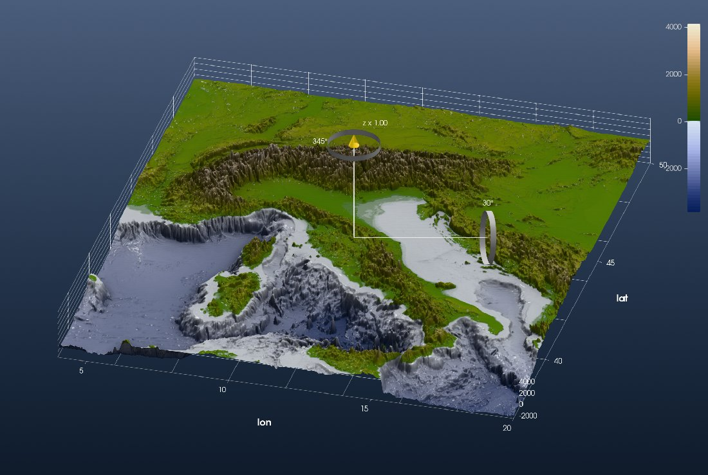
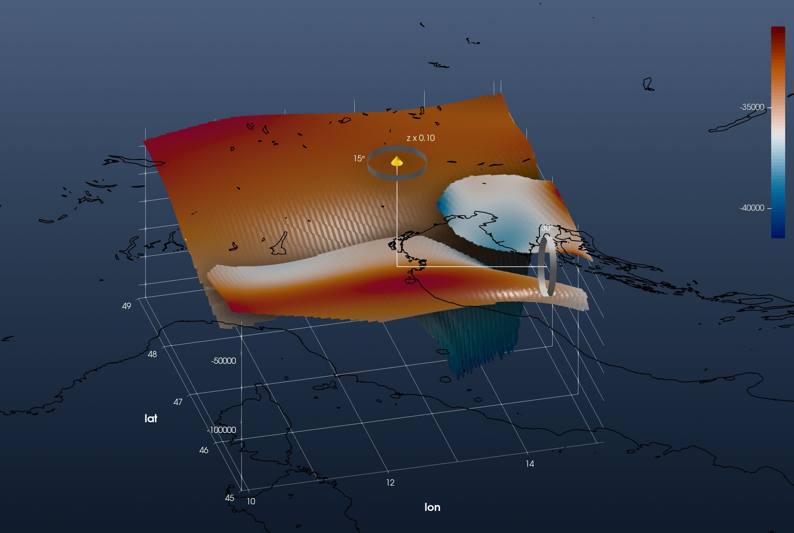
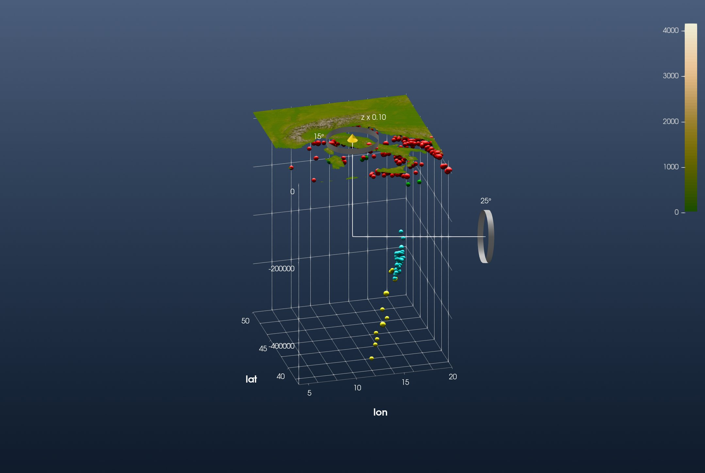
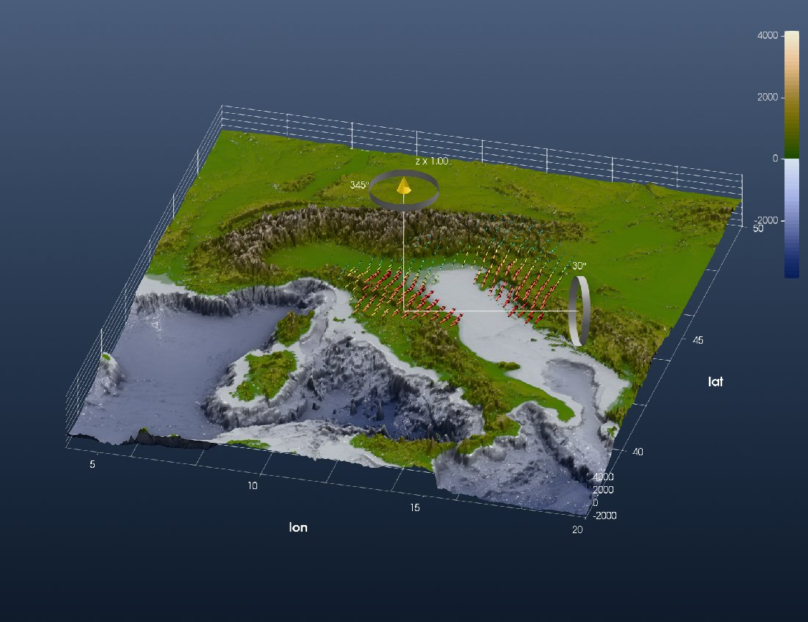
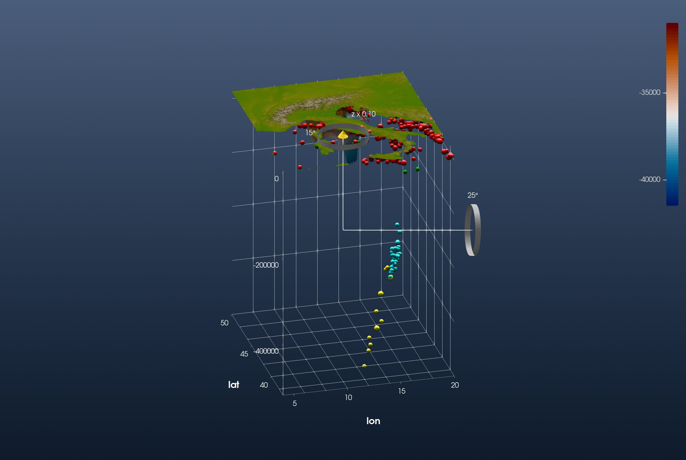

```@meta
CurrentModule = InteractiveGMT
```

# Tutorial: Alpine Data Integration

This is the GeophysicalModelGenerator.jl tutorial
[*Alpine data integration*](https://juliageodynamics.github.io/GeophysicalModelGenerator.jl/dev/man/Tutorial_AlpineData/)
redone with iGMT and plain GMT.jl commands: no DelimitedFiles, NearestNeighbors, Plots or ParaView.
It brings the topography, the Moho, the seismicity and the GPS velocities of the Alps into one
3-D scene.

## 1. Surface topography

```julia
using GMT, InteractiveGMT

Topo = grdcut("@earth_relief_01m", region=(4, 20, 37, 50))
fig  = iview(Topo; cmap=:oleron)
```

Switch to **3D** on the toolbar and turn the view with the gizmo:



## 2. Moho topography

The Moho map of Mroczek et al. (2023) is a CSV file with 12 header lines. Its last column says which
Moho a point belongs to: `EU` (European), `AD` (Adriatic) or `PA` (Pannonian). GMG reads it with
`readdlm` and splits the columns by hand. GMT's `gmtconvert` does both: `e=",EU"` keeps only the
records that contain `,EU`, and `i` picks longitude, latitude and depth, the depth turned into
metres below sea level (`+s-1000`):

```julia
download("https://datapub.gfz-potsdam.de/download/10.5880.GFZ.2.4.2021.009NUEfb/2021-009_Mroczek-et-al_SWATHD_moho_jul22.csv",
         "MohoMroczek2023.csv")

MohoEU = gmtconvert("MohoMroczek2023.csv", h=12, i="4,3,5+s-1000", e=",EU")
MohoAD = gmtconvert("MohoMroczek2023.csv", h=12, i="4,3,5+s-1000", e=",AD")
MohoPA = gmtconvert("MohoMroczek2023.csv", h=12, i="4,3,5+s-1000", e=",PA")
```

GMG then grids each Moho on a 0.02° grid, keeping a node only when a data point lies within 0.02°
of it (a KD-tree search). That is GMT's `nearneighbor` with one sector:

```julia
GEU = nearneighbor(MohoEU, region=(9.9, 15.1, 45, 49), inc=0.02, S="0.02d", N=1)
GAD = nearneighbor(MohoAD, region=(9.9, 15.1, 45, 49), inc=0.02, S="0.02d", N=1)
GPA = nearneighbor(MohoPA, region=(9.9, 15.1, 45, 49), inc=0.02, S="0.02d", N=1)
```

The three Mohos are elevations in metres, like the topography, so they go on its vertical scale
(`samezscale=true`). Each added grid comes on display alone; tick the others back on:

```julia
add!(fig, GEU; name="Moho EU", cmap=:vik, samezscale=true)
add!(fig, GAD; name="Moho AD", cmap=:vik, samezscale=true)
add!(fig, GPA; name="Moho PA", cmap=:vik, samezscale=true)
setvisible!(fig, "Moho EU")
setvisible!(fig, "Moho AD")
```

Every added grid brings its own axes, and one figure has one set. The three Mohos share one box,
so keep the European Moho's and switch the other two off:

```julia
setvisible!(fig, "Axes", false; layer="Moho AD")
setvisible!(fig, "Axes", false; layer="Moho PA")
```

The Moho lies 30 to 150 km deep, so lower the vertical exaggeration (*View → Vertical
Exaggeration…*, 0.1) and look from below the sea surface. The coastline makes the map readable
without the topography:

```julia
Coast = coast(region=(4, 20, 37, 50), shore=true, resolution=:intermediate, dump=true)
add!(fig, Coast; color=:black)
```



## 3. Seismicity

GMG downloads the ISC-EHB bulletin as QuakeML and reads it with its own parser. ISC also serves
the bulletin in the ISF format, and GMT reads ISF (`gmtisf`), so here it is ISF:

```julia
download("http://www.isc.ac.uk/cgi-bin/web-db-run?out_format=ISF&searchshape=RECT&top_lat=49&bot_lat=37&left_lon=4&right_lon=20&start_year=1990&start_month=1&start_day=01&start_time=00%3A00%3A00&end_year=2015&end_month=12&end_day=31&end_time=00%3A00%3A00&min_mag=3.0&req_mag_type=Any&req_mag_agcy=Any&include_magnitudes=on&include_links=off&include_headers=on&include_comments=off&prime_only=on&request=COLLECTED&req_agcy=ISC-EHB&table_owner=iscehb",
         "ISCData.isf")

EQ = gmtisf("ISCData.isf")          # 349 events: lon, lat, depth, magnitude, date
```

(`gmtisf` is what iGMT's Seismicity tool uses to read the file below.)

GMG shows the topography of the land only, so that what lies under the sea stays visible.
`grdclip` does that:

```julia
Land = grdclip(Topo, below="0/NaN")
fig  = iview(Land; cmap=:oleron)
```

Then *Geophysics → Seismicity…*: choose *ISF formated catalog (ascii)* and `ISCData.isf`, and tick
*Use different sizes for magnitude intervals* and *Use different colors for depth intervals*.
Every event is plotted at its own depth:



The deep events are the Calabrian slab, dipping to 500 km under the Tyrrhenian Sea.

## 4. GPS velocities

The GPS velocities of Sánchez et al. (2018) are the subject of
[Tutorial: GPS Velocities of the Alps](68-gps-sanchez.md). Read the horizontal field as there:

```julia
url = "https://store.pangaea.de/Publications/Sanchez-etal_2018/ALPS2017_DEF_"
Vh  = gmtread(url * "HZ.GRD", data=true, h=17, incols="0,1,2+s1000,3+s1000")   # lon lat Ve Vn, mm/yr
gmtwrite("ALPS2017_Vh_mm_yr.txt", Vh)
```

and bring it in with *File → Open xy(z) → Import Arrow field*: solid 3-D arrows, coloured by
magnitude. *Arrow length…* in the arrows' properties makes them longer.



## 5. Everything together

All of it in one window: the land topography, the seismicity, the three Mohos and the GPS arrows.
The land topography's axes frame the whole scene, so the three Mohos' own axes are switched off:

```julia
setvisible!(fig, "Axes", false; layer="Moho EU")
setvisible!(fig, "Axes", false; layer="Moho AD")
setvisible!(fig, "Axes", false; layer="Moho PA")
```

Set the vertical exaggeration to 0.1 on every layer, and look from the south-south-west:


