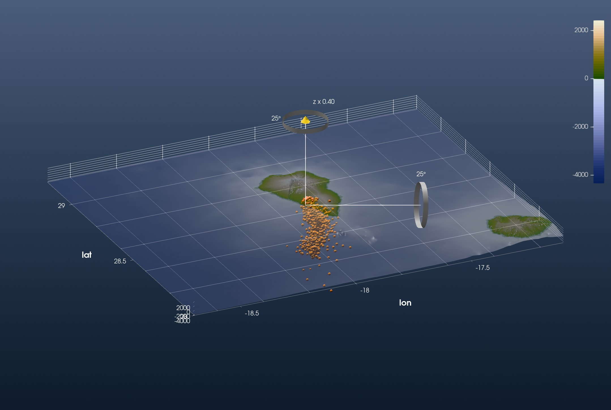
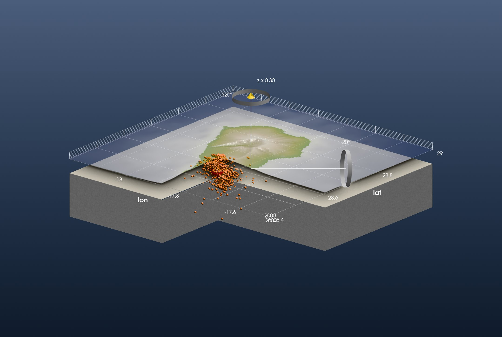

```@meta
CurrentModule = InteractiveGMT
```

# Tutorial: La Palma Volcano

This is the GeophysicalModelGenerator.jl tutorial
[*La Palma volcano Model*](https://juliageodynamics.github.io/GeophysicalModelGenerator.jl/dev/man/Tutorial_LaPalma/)
redone with iGMT and plain GMT.jl commands: no DelimitedFiles, no ParaView. Both of its figures are
recreated below.

The data are the earthquakes of the 2021 Cumbre Vieja eruption on La Palma, from the IGN catalogue
([ign.es](https://www.ign.es/web/ign/portal/vlc-catalogo)), filtered by the GMG authors and
published on Zenodo ([10738510](https://zenodo.org/records/10738510)).

## 1. Topography and earthquakes

GMG's first figure spans La Palma and La Gomera, from 3″ earth relief:

```julia
using GMT, InteractiveGMT

Topo = grdcut("@earth_relief_03s", region=(-18.7, -17.1, 28.0, 29.2))
```

The earthquake file has ten columns: longitude, latitude, depth (km), the date and time, and the
magnitude last. GMG reads it with `readdlm` and picks the columns. `gmtread` does it in one call:
`incols` keeps longitude, latitude, the depth turned into metres below sea level (`+s-1000`), and
the magnitude:

```julia
download("https://zenodo.org/records/10738510/files/EQ_events_all_info5_LaPalma_2021.dat", "EQ_LaPalma_2021.dat")
EQ = gmtread("EQ_LaPalma_2021.dat", incols="0,1,2+s-1000,9")
```

Show the topography and put every earthquake at its hypocentre, as a sphere sized by its
magnitude (M −1 to 4.8). As in GMG's figure the topography is half transparent, so the earthquakes
show through the sea floor:

```julia
fig = iview(Topo; cmap=:oleron)
add_symbols!(fig, EQ[:, 1], EQ[:, 2]; z=EQ[:, 3], symbol=:sphere, size=1 .+ (EQ[:, 4] .+ 1),
             fill=:orange, name="Earthquakes 2021")
setopacity!(fig, 0.5)
```

Switch to **3D** on the toolbar, set *View → Vertical Exaggeration…* to 0.4, and look from the
south-south-west:



This is GMG's first figure. The 4238 earthquakes form a column under the southern ridge of the
island, down to 30 km, densest between 5 and 10 km. The shallow events at the top sit under the
2021 vent on the western flank (17.88° W, 28.61° N).

## 2. Earthquake density in 3-D

GMG turns the catalogue into a volume: it counts the earthquakes near every node of a 3-D grid, and
where more than a threshold fall close together it marks the rock as magma. GMT counts points
around grid nodes with `binstats`: `C=:n` counts, `S="1k"` counts within 1 km of each node. One
horizontal layer is the earthquakes of a 1.5 km thick slab, picked by depth with `gmtselect`:

```julia
R = (-17.96, -17.68, 28.48, 28.70)
B = binstats(gmtselect(EQ, Z="-10750/-9250"), C=:n, S="1k", region=R, inc=0.005)
```

The cube is that layer every 500 m from 27 km deep to sea level, stacked by `mat2grid` with the
layer depths as its third coordinate:

```julia
zs = -27000:500:0
Count = mat2grid(cat([binstats(gmtselect(EQ, Z="$(z-750)/$(z+750)"), C=:n, S="1k", region=R, inc=0.005).z for z in zs]...; dims=3),
                 x=B.x, y=B.y, v=collect(Float64, zs))
```

Up to 759 earthquakes fall around one node. Above 40 there are two bodies: one from sea level to
12 km under the western flank, and a smaller one between 15.5 and 24.5 km.

## 3. The model

GMG builds its model over La Palma alone:

```julia
TopoModel = grdcut("@earth_relief_15s", region=(-18.2, -17.5, 28.4, 29.0))
```

The model has a lower crust below 15 km, cut open towards the viewer. Here the same quadrant,
south-east of 17.875° W, 28.605° N, is cut out of the topography and of a flat grid 15 km down.
`grdmath` sets it to NaN:

```julia
TopoCut = grdmath("? X -17.875 GT Y 28.605 LT MUL 1 NAN ADD", TopoModel)
Crust   = grdmath("? 0 MUL X -17.875 GT Y 28.605 LT MUL 1 NAN ADD -15000 ADD", TopoModel)
```

The crust's top and walls take plain colours:

```julia
beige = mat2img(cat(fill(0xd8, 2, 2), fill(0xd3, 2, 2), fill(0xc4, 2, 2); dims=3))
grey  = mat2img(cat(fill(0x88, 2, 2), fill(0x88, 2, 2), fill(0x88, 2, 2); dims=3))
```

The scene: the cut topography, the earthquakes, the crust's top on the topography's vertical scale,
its walls as one **curtain** around the block and the cut, and the magma as an **iso-surface** of
the count cube, the surface where it crosses 40:

```julia
fig = iview(TopoCut; cmap=:oleron)
add_symbols!(fig, EQ[:, 1], EQ[:, 2]; z=EQ[:, 3], symbol=:sphere, size=1 .+ (EQ[:, 4] .+ 1),
             fill=:orange, name="Earthquakes 2021")
add!(fig, Crust; name="Lower crust", drape=beige, samezscale=true)
add_curtain!(fig, [-18.2 28.4; -17.875 28.4; -17.875 28.605; -17.5 28.605; -17.5 29.0; -18.2 29.0; -18.2 28.4];
             image=grey, zrange=(-50000, -15000))
add_isosurface!(fig, Count; level=40, color=:red, name="Magma")
setvisible!(fig, "Surface")
setvisible!(fig, "Lower crust")
setopacity!(fig, 0.5)
```

Every added layer brings its own axes. One figure has one set, the topography's, so the other two
are switched off by their *Axes* rows:

```julia
setvisible!(fig, "Axes", false; layer="Lower crust")
setvisible!(fig, "Axes", false; layer="Magma")
```

*View → Vertical Exaggeration…* sets 0.3 on the topmost layer on display. Set it on *Magma*, untick
it, set it on *Lower crust*, untick that, set it on the topography, and tick both back on. Switch
to **3D** and look into the cut from the south-east:



This is GMG's second figure. The magma body sits in the thick of the earthquakes, from sea level
to 12 km under the western flank.
