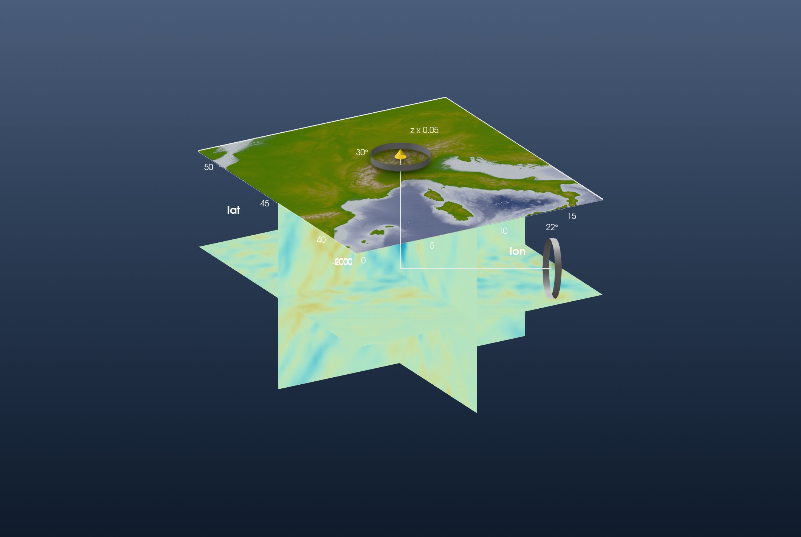
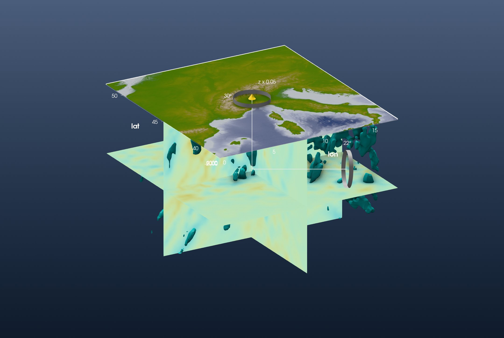

```@meta
CurrentModule = InteractiveGMT
```

# Tutorial: Slicing a Tomography Model

This is the GeophysicalModelGenerator.jl page
[*Visualisation*](https://juliageodynamics.github.io/GeophysicalModelGenerator.jl/dev/man/visualise/)
redone with iGMT and plain GMT.jl commands: no GMG, no GLMakie.

GMG's `visualise` widget shows a 3-D seismic velocity model as three orthogonal slices, one at a
constant longitude, one at a constant latitude and one at a constant depth, under the topography.
The model is Zhao et al.'s (2016) P-wave tomography of the Alps (*Continuity of the Alpine slab
unraveled by high-resolution P wave tomography*, JGR Solid Earth).

## 1. Load the data

GMG loads the model from `Zhao_Pwave.jld2`, a file its own tomography tutorial writes. The data
behind it is an ASCII table on GMG's data share, one row per node: longitude, latitude, depth (km,
negative down) and the P-wave velocity anomaly in percent. `gmtread` reads it as it is:

```julia
using GMT, InteractiveGMT

download("https://seafile.rlp.net/d/a50881f45aa34cdeb3c0/files/?p=%2FZhao_etal_JGR_2016_Pwave_Alps_3D_k60.txt&dl=1",
         "Zhao_etal_JGR_2016_Pwave_Alps_3D_k60.txt")
Zhao = gmtread("Zhao_etal_JGR_2016_Pwave_Alps_3D_k60.txt")
```

The nodes are regular: 0° to 18° E and 38° to 51.95° N every 0.15°, and 1001 to 1 km deep
every 10 km. The anomaly runs from −9.15 % to 8.96 %.

The topography is GMT's own 1′ earth relief over the same box:

```julia
Topo = grdcut("@earth_relief_01m", region=(0, 18, 38, 52))
```

GMG colours the model with the `roma` scale over the data's full range:

```julia
C = makecpt(cmap=:roma, range=(-9.15, 8.96))
```

## 2. Cut the three slices

A slice is the rows of the table on one plane, gridded by `xyz2grd`. The depth slice at 511 km
keeps longitude, latitude and anomaly:

```julia
z511 = xyz2grd(Zhao[Zhao[:, 3] .== -511, [1, 2, 4]], region=(0, 18, 38, 51.95), inc=0.15)
```

The vertical slices along 8.85° E and 44.9° N keep latitude (or longitude), depth and anomaly:

```julia
lon885 = xyz2grd(Zhao[Zhao[:, 1] .== 8.85, [2, 3, 4]], region=(38, 51.95, -1001, -1), inc=(0.15, 10))
lat449 = xyz2grd(Zhao[Zhao[:, 2] .== 44.9, [1, 3, 4]], region=(0, 18, -1001, -1), inc=(0.15, 10))
```

`grdimage` with `A=true` turns each slice into its picture in the `roma` colours:

```julia
img511 = grdimage(z511, cmap=C, A=true)
imglon = grdimage(lon885, cmap=C, A=true)
imglat = grdimage(lat449, cmap=C, A=true)
```

## 3. Put them in the scene

The topography opens the window:

```julia
fig = iview(Topo; cmap=:oleron)
```

The depth slice is a flat grid 511 km down, wearing its picture. It is a depth on the same vertical
scale as the topography, both in metres (`samezscale=true`). Adding it puts it on display; tick the
topography (the *Surface* row) back on:

```julia
flat511 = grdmath("? 0 MUL -511000 ADD", z511)
add!(fig, flat511; name="dVp at 511 km", drape=img511, samezscale=true)
setvisible!(fig, "Surface")
```

Every added grid brings its own axes, and one figure has one set, the topography's. Switch the
slice's off:

```julia
setvisible!(fig, "Axes", false; layer="dVp at 511 km")
```

The two vertical slices hang as **curtains** along their lines, from 1001 km to 1 km deep:

```julia
add_curtain!(fig, [8.85 38; 8.85 51.95]; image=imglon, zrange=(-1001000, -1000))
add_curtain!(fig, [0 44.9; 18 44.9]; image=imglat, zrange=(-1001000, -1000))
```

The model is 1000 km deep under an 18° wide map, so it needs a small vertical exaggeration.
*View → Vertical Exaggeration…* sets it on the topmost grid on display, the depth slice: set 0.05.
Untick *dVp at 511 km*, set 0.05 again (now for the topography), and tick it back on. Switch to
**3D** and look at the model from the south-west:



The fast (blue) anomaly under the Alps is the subducted Alpine slab. On the 8.85° E curtain it
is strongest (above 3 %) between 44.3° and 45.65° N, from about 20 km down to about 420 km.

## 4. The iso-surface

GMG's widget also draws an **iso-surface**: the surface where the anomaly crosses a value, 1.7 % in
its figure. `xyzw2cube` reads the same table as a 3-D cube; its layer depths are in km, and the
scene is in metres:

```julia
Cube = xyzw2cube("Zhao_etal_JGR_2016_Pwave_Alps_3D_k60.txt")
Cube.v .*= 1000
```

`add_isosurface!` adds the surface as its own layer, on the topography's vertical scale. Like every
added layer it becomes the layer on display; tick the others back on:

```julia
add_isosurface!(fig, Cube; level=1.7, color=:cyan, name="dVp = 1.7 %")
setvisible!(fig, "Surface")
setvisible!(fig, "dVp at 511 km")
```

Ticking a layer back on ticks its axes too, so switch the slice's and the new surface's off again:

```julia
setvisible!(fig, "Axes", false; layer="dVp at 511 km")
setvisible!(fig, "Axes", false; layer="dVp = 1.7 %")
```

Set the vertical exaggeration of the new layer to 0.05 as well, and switch to **3D**:



This is GMG's figure. 24 135 of the model's nodes are faster than 1.7 %. Above 300 km they are
centred on 11.3° E, 44.9° N, under the Po plain; 5676 of them lie below the 511 km slice.
