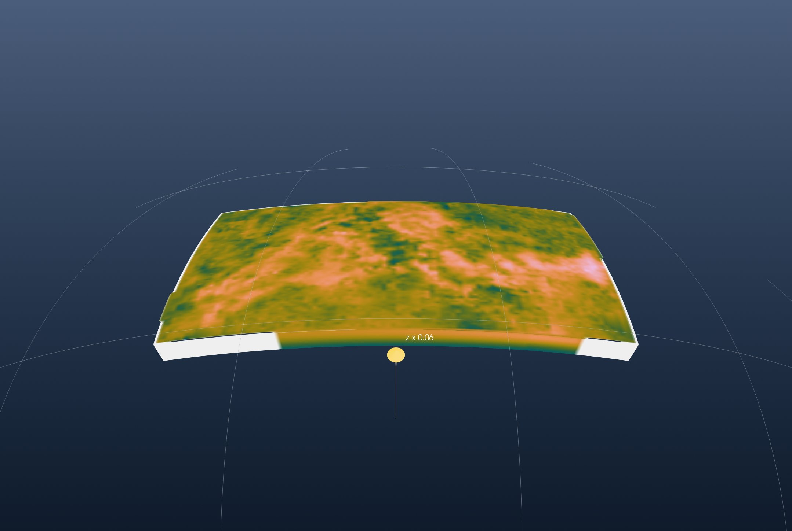
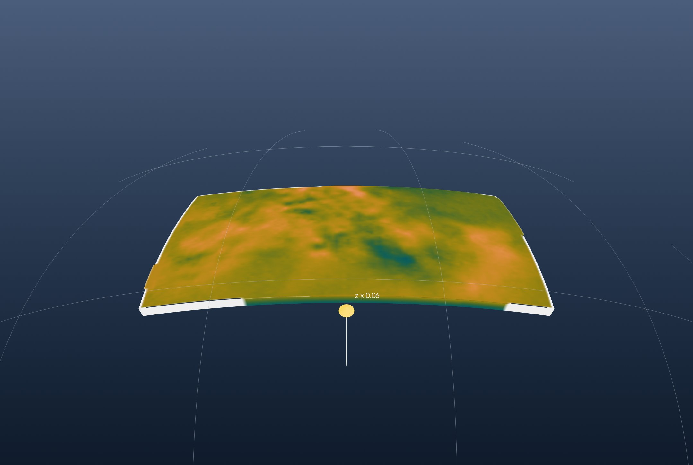

```@meta
CurrentModule = InteractiveGMT
```

# Tutorial: A Tomography Model from netCDF

This is the GeophysicalModelGenerator.jl tutorial
[*3D tomography model in netCDF format*](https://juliageodynamics.github.io/GeophysicalModelGenerator.jl/dev/man/tutorial_loadregular3DSeismicData_netCDF/)
redone with iGMT and plain GMT.jl commands: no NetCDF.jl, no GMG, no ParaView.

The model is MeRE2020, the shear-wave velocity of the Mediterranean upper mantle by El-Sharkawy et
al. (2020, [*The Slab Puzzle of the Alpine-Mediterranean Region*](https://doi.org/10.1029/2020GC008993),
G³), from the EarthScope (formerly IRIS) Earth Model Collaboration.

## 1. Read the model

The netCDF file has one variable, `Vs` in km/s, on 100 longitudes, 100 latitudes and 301 depths
from 50 to 350 km:

```julia
using GMT, InteractiveGMT

download("https://data.earthscope.org/archive/seismology/products/emc/netcdf/El-Sharkawy-etal-G3.2020-MeRE2020-Mediterranean.r0.0-n4c.nc",
         "MeRE2020.nc")
```

GMG reads each variable with NetCDF.jl and assembles the 3-D coordinates itself. `gmtread` with
`layers=:all` reads the whole file as one cube, coordinates included. The file's longitude and
latitude steps vary slightly; GMT warns once per layer and uses their mean, and `V=:q` keeps it
quiet:

```julia
C = gmtread("MeRE2020.nc", layers=:all, V=:q)
```

The cube spans 11.3° W to 46.3° E and 28.9° N to 51.1° N, and Vs runs from 3.9 to 5.04 km/s.

GMG colours it with a scale from pink (slow) to dark blue (fast); GMT's `batlow`, reversed, is that
scale:

```julia
cpt = makecpt(cmap=:batlow, range=(3.9, 5.1), reverse=true)
```

## 2. The block

GMG shows the model as a solid block on the curved Earth, its outer faces coloured by Vs. Its top is the first layer,
at 50 km, cut out by `slicecube` and turned into a picture by `grdimage`:

```julia
L50   = slicecube(C, 1)
img50 = grdimage(L50, cmap=cpt, A=true)
```

The top face is a flat grid 50 km down, wearing that picture:

```julia
top = grdmath("? 0 MUL -50000 ADD", L50)
```

The four side faces are the cube's outer rows and columns, each a depth section. `mat2grid` makes
each one a grid and `grdimage` its picture:

```julia
south = grdimage(mat2grid(permutedims(C.z[1, :, :])), cmap=cpt, A=true)
north = grdimage(mat2grid(permutedims(C.z[end, :, :])), cmap=cpt, A=true)
west  = grdimage(mat2grid(permutedims(C.z[:, 1, :])), cmap=cpt, A=true)
east  = grdimage(mat2grid(permutedims(C.z[:, end, :])), cmap=cpt, A=true)
```

GMG draws the model on the sphere, and so does iGMT's globe view. A globe's vertical scale comes
from the window's own grid, so the window opens on the region's topography, which also sets the
block's depths in metres, and the top face stands on the same scale (`samezscale=true`):

```julia
Topo = grdcut("@earth_relief_05m", region=(-11.3, 46.3, 28.9, 51.1))

fig = iview(Topo; cmap=:oleron)
add!(fig, top; name="Vs at 50 km", drape=img50, samezscale=true)
```

The side faces hang as **curtains** along the block's edges, from 350 km to 50 km deep. A section's
first row is its shallowest, drawn at the bottom of its picture, so `flipv=true` turns it upright:

```julia
add_curtain!(fig, [-11 29; 46 29]; image=south, zrange=(-350000, -50000), flipv=true)
add_curtain!(fig, [-11 51; 46 51]; image=north, zrange=(-350000, -50000), flipv=true)
add_curtain!(fig, [-11 29; -11 51]; image=west,  zrange=(-350000, -50000), flipv=true)
add_curtain!(fig, [46 29; 46 51];  image=east,  zrange=(-350000, -50000), flipv=true)
```

GMG's figure shows the model alone, so the topography is switched off:

```julia
setvisible!(fig, "Surface", false)
```

Pick **Globe (orthographic)** from the arrow of the toolbar's 2D/3D button. *View → Vertical
Exaggeration…* set 0.063, close to true scale for this topography, on *Vs at 50 km* and on the
topography. Turn the globe to look at the block from the south:



This is GMG's first figure. On the top face, at 50 km, the slowest mantle (3.91 km/s) is under
eastern Anatolia (42.5° E, 39.4° N) and the fastest (4.85 km/s) at 28.1° E, 47.4° N, on the edge of
the East European platform. The sides show Vs rising with depth. The white bands are where the
model has no values along its edges.

## 3. The model below 200 km

GMG's second figure keeps the part of the model below a sphere 200 km under the surface. The same
view here is the block below 200 km: layer 151 is the 200 km layer, and the walls are the same
sections from their 151st row down:

```julia
L200   = slicecube(C, 151)
img200 = grdimage(L200, cmap=cpt, A=true)
top200 = grdmath("? 0 MUL -200000 ADD", L200)

south2 = grdimage(mat2grid(permutedims(C.z[1, :, 151:end])), cmap=cpt, A=true)
north2 = grdimage(mat2grid(permutedims(C.z[end, :, 151:end])), cmap=cpt, A=true)
west2  = grdimage(mat2grid(permutedims(C.z[:, 1, 151:end])), cmap=cpt, A=true)
east2  = grdimage(mat2grid(permutedims(C.z[:, end, 151:end])), cmap=cpt, A=true)

fig2 = iview(Topo; cmap=:oleron)
add!(fig2, top200; name="Vs at 200 km", drape=img200, samezscale=true)
add_curtain!(fig2, [-11 29; 46 29]; image=south2, zrange=(-350000, -200000), flipv=true)
add_curtain!(fig2, [-11 51; 46 51]; image=north2, zrange=(-350000, -200000), flipv=true)
add_curtain!(fig2, [-11 29; -11 51]; image=west2,  zrange=(-350000, -200000), flipv=true)
add_curtain!(fig2, [46 29; 46 51];  image=east2,  zrange=(-350000, -200000), flipv=true)
setvisible!(fig2, "Surface", false)
```

Switch to **Globe (orthographic)**, set the same vertical exaggeration, 0.063, and the same view:



At 200 km the fastest mantle (4.81 km/s) is south of Crete (25.8° E, 35.4° N), where the African
plate sinks under the Hellenic arc. The fastest 5 % of the layer lies there, under the Alps and
north of the Black Sea.
