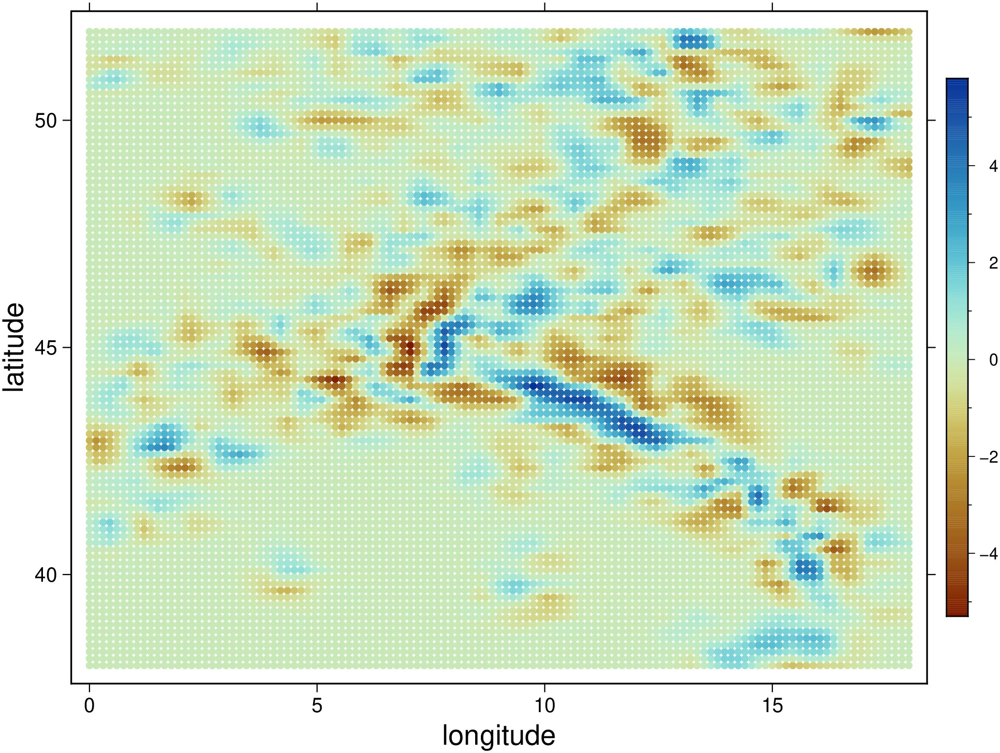
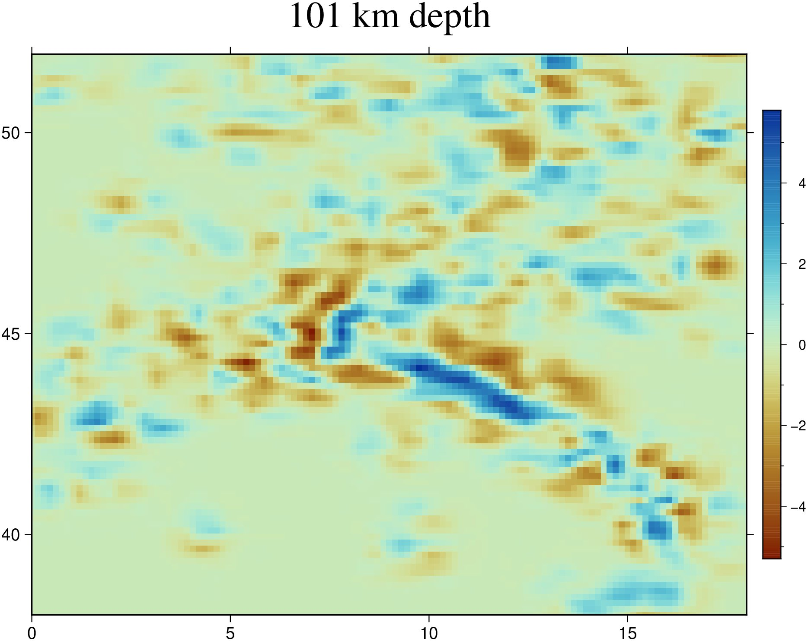
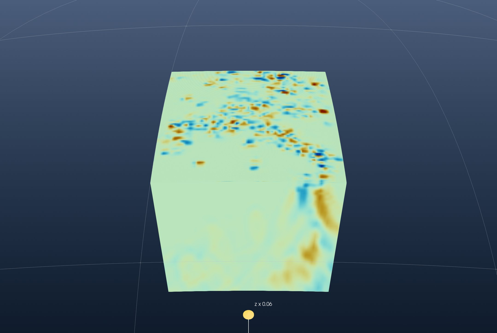
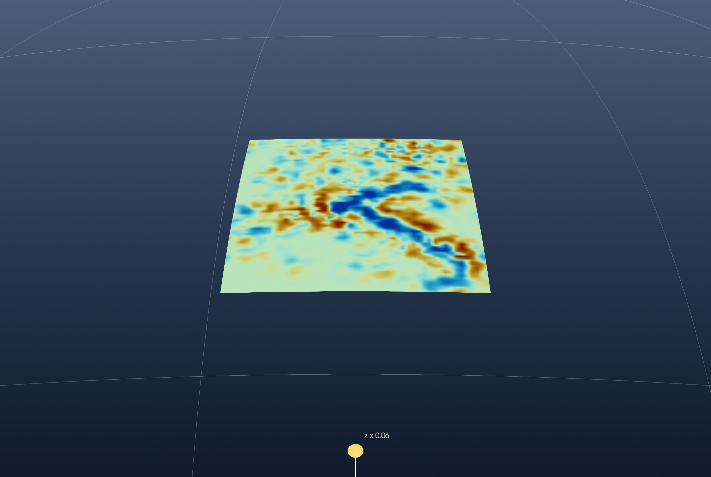
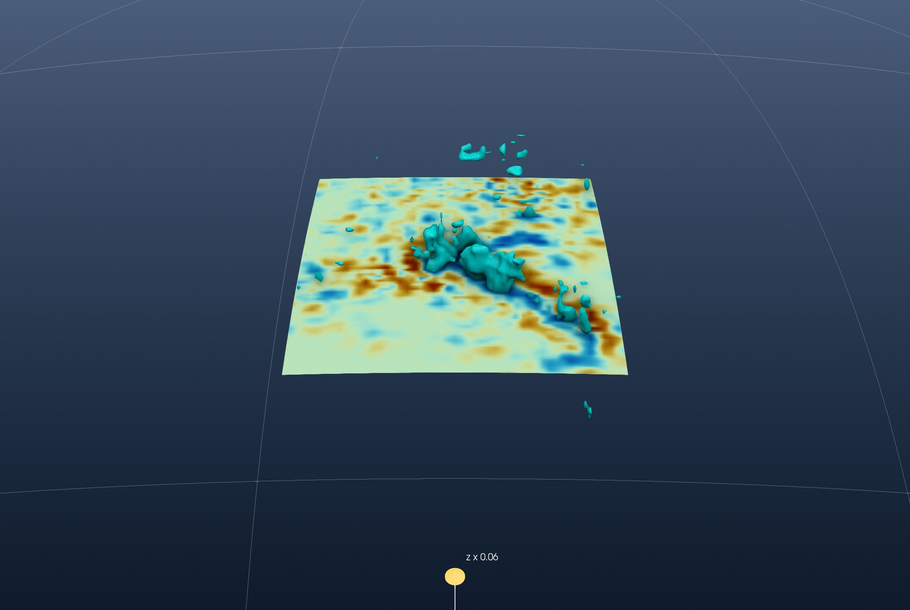
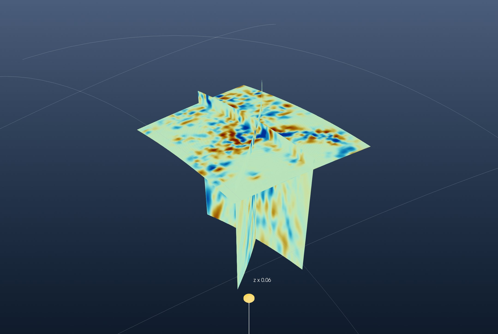
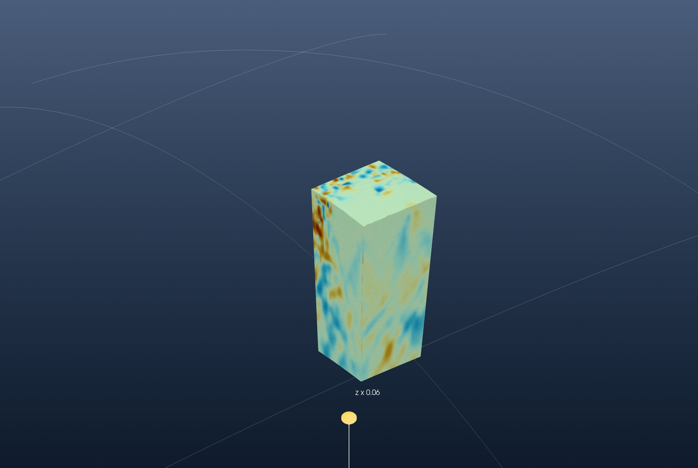

```@meta
CurrentModule = InteractiveGMT
```

# Tutorial: A Tomography Model from ASCII

This is the GeophysicalModelGenerator.jl tutorial
[*3D seismic tomography from ASCII*](https://juliageodynamics.github.io/GeophysicalModelGenerator.jl/dev/man/tutorial_load3DSeismicData/)
redone with iGMT and plain GMT.jl commands: no DelimitedFiles, Plots, GMG or ParaView.

The model is Zhao et al.'s (2016) P-wave tomography of the Alps (*Continuity of the Alpine slab
unraveled by high-resolution P wave tomography*, JGR Solid Earth): the velocity anomaly, in percent,
on a regular grid of longitude, latitude and depth.

## 1. Read the data

The file is an ASCII table, one row per node: longitude, latitude, depth (km, negative down) and the
anomaly. `gmtread` reads it as it is:

```julia
using GMT, InteractiveGMT

download("https://seafile.rlp.net/d/a50881f45aa34cdeb3c0/files/?p=%2FZhao_etal_JGR_2016_Pwave_Alps_3D_k60.txt&dl=1",
         "Zhao_etal_JGR_2016_Pwave_Alps_3D_k60.txt")
Zhao = gmtread("Zhao_etal_JGR_2016_Pwave_Alps_3D_k60.txt")
```

GMG checks that the nodes are regular by plotting one depth level. The rows at 101 km, coloured by
the anomaly with the `roma` scale:

```julia
D101 = Zhao[Zhao[:, 3] .== -101, [1, 2, 4]]
C101 = makecpt(cmap=:roma, range=(-5.3, 5.8))
scatter(D101, marker=:circle, ms=0.12, zcolor=D101[:, 3], cmap=C101, frame=(axes=:WSen, annot=:auto),
        xlabel="longitude", ylabel="latitude", colorbar=true, figsize=(14, 11), show=true)
```



They are: 0° to 18° E and 38° to 51.95° N every 0.15°, 11 374 nodes per level, and 101 levels from
1001 km to 1 km every 10 km. As a map, `xyz2grd` grids that level:

```julia
G101 = xyz2grd(D101, region=(0, 18, 38, 51.95), inc=0.15)
grdimage(G101, cmap=C101, frame=(axes=:WSen, annot=:auto, title="101 km depth"), colorbar=true,
         figsize=(14, 11), show=true)
```



## 2. The cube

GMG reshapes the four columns into 3-D arrays. `xyzw2cube` does it in one call and returns a GMT
cube; its layer depths are in km, and the scenes below are in metres:

```julia
Cube = xyzw2cube("Zhao_etal_JGR_2016_Pwave_Alps_3D_k60.txt")
Cube.v .*= 1000
```

GMG draws the model in ParaView as a block on the curved Earth, coloured from −3 % to 3 %:

```julia
cpt  = makecpt(cmap=:roma, range=(-3, 3))
Topo = grdcut("@earth_relief_05m", region=(0, 18, 38, 52))
```

The block's top is the shallowest layer, and its sides are the cube's outer rows and columns, hung
as **curtains**. The window opens on the region's topography, which a globe needs for its vertical
scale, and then hides it:

```julia
Ltop   = slicecube(Cube, 101)
imgtop = grdimage(Ltop, cmap=cpt, A=true)
top    = grdmath("? 0 MUL -1000 ADD", Ltop)

south = grdimage(mat2grid(permutedims(Cube.z[1, :, :])),   cmap=cpt, A=true)
north = grdimage(mat2grid(permutedims(Cube.z[end, :, :])), cmap=cpt, A=true)
west  = grdimage(mat2grid(permutedims(Cube.z[:, 1, :])),   cmap=cpt, A=true)
east  = grdimage(mat2grid(permutedims(Cube.z[:, end, :])), cmap=cpt, A=true)

fig = iview(Topo; cmap=:oleron)
add!(fig, top; name="dVp at 1 km", drape=imgtop, samezscale=true)
add_curtain!(fig, [0 38; 18 38];       image=south, zrange=(-1001000, -1000))
add_curtain!(fig, [0 51.95; 18 51.95]; image=north, zrange=(-1001000, -1000))
add_curtain!(fig, [0 38; 0 51.95];     image=west,  zrange=(-1001000, -1000))
add_curtain!(fig, [18 38; 18 51.95];   image=east,  zrange=(-1001000, -1000))
setvisible!(fig, "Surface", false)
```

Pick **Globe (orthographic)** from the arrow of the toolbar's 2D/3D button, set *View → Vertical
Exaggeration…* to 0.063, close to true scale for this topography, and turn the globe to look at the
block from the south:



## 3. A depth slice

GMG cuts the model with a sphere 200 km deep. The cube's layer 81 is 201 km:

```julia
L201   = slicecube(Cube, 81)
img201 = grdimage(L201, cmap=cpt, A=true)
top201 = grdmath("? 0 MUL -201000 ADD", L201)

fig2 = iview(Topo; cmap=:oleron)
add!(fig2, top201; name="dVp at 201 km", drape=img201, samezscale=true)
setvisible!(fig2, "Surface", false)
```

The same globe, vertical exaggeration and view:



The fast (blue) band from the Alps to the south-east is the subducted slab.

## 4. Where the anomaly exceeds 3 %

GMG clips the volume at 3 %, which keeps the space where the anomaly is higher. Its outer surface
is the **iso-surface** at 3 %:

```julia
add_isosurface!(fig2, Cube; level=3, color=:cyan, name="dVp = 3 %")
setvisible!(fig2, "dVp at 201 km")
```



## 5. Vertical sections

GMG's sections are along 10° E and along a diagonal from (1° E, 39° N) to (18° E, 50° N).
`grdinterpolate` samples the cube along a line (`E`), which gives the section as a grid of distance
against depth. It reads the cube from a file:

```julia
gmtwrite("zhao_cube.nc", Cube)
S10   = grdinterpolate("zhao_cube.nc", E="10/38/10/51.95+n100", V=:q)
Sdiag = grdinterpolate("zhao_cube.nc", E="1/39/18/50+n300", V=:q)
```

The two sections hang as curtains, under a horizontal slice at 101 km:

```julia
L101   = slicecube(Cube, 91)
img101 = grdimage(L101, cmap=cpt, A=true)
top101 = grdmath("? 0 MUL -101000 ADD", L101)

fig3 = iview(Topo; cmap=:oleron)
add!(fig3, top101; name="dVp at 101 km", drape=img101, samezscale=true)
add_curtain!(fig3, [10 38; 10 51.95]; image=grdimage(S10, cmap=cpt, A=true),   zrange=(-1001000, -1000))
add_curtain!(fig3, [1 39; 18 50];     image=grdimage(Sdiag, cmap=cpt, A=true), zrange=(-1001000, -1000))
setvisible!(fig3, "Surface", false)
```

Look from the south-west:



## 6. A subvolume

GMG's last step keeps 5° to 12° E and 40° to 45° N. The nodes inside are found on the cube's own
coordinates, and `mat2grid` makes them a cube of their own:

```julia
ix  = findall(x -> 5 <= x <= 12, Cube.x)
iy  = findall(y -> 40 <= y <= 45, Cube.y)
Sub = mat2grid(Cube.z[iy, ix, :], x=Cube.x[ix], y=Cube.y[iy], v=Cube.v)
```

It is drawn as the block was, its top and four sides:

```julia
Stop = slicecube(Sub, 101)
topS = grdmath("? 0 MUL -1000 ADD", Stop)

fig4 = iview(Topo; cmap=:oleron)
add!(fig4, topS; name="Subset top", drape=grdimage(Stop, cmap=cpt, A=true), samezscale=true)
add_curtain!(fig4, [5.1 40.1; 12 40.1]; image=grdimage(mat2grid(permutedims(Sub.z[1, :, :])),   cmap=cpt, A=true), zrange=(-1001000, -1000))
add_curtain!(fig4, [5.1 44.9; 12 44.9]; image=grdimage(mat2grid(permutedims(Sub.z[end, :, :])), cmap=cpt, A=true), zrange=(-1001000, -1000))
add_curtain!(fig4, [5.1 40.1; 5.1 44.9]; image=grdimage(mat2grid(permutedims(Sub.z[:, 1, :])),  cmap=cpt, A=true), zrange=(-1001000, -1000))
add_curtain!(fig4, [12 40.1; 12 44.9];  image=grdimage(mat2grid(permutedims(Sub.z[:, end, :])), cmap=cpt, A=true), zrange=(-1001000, -1000))
setvisible!(fig4, "Surface", false)
```


