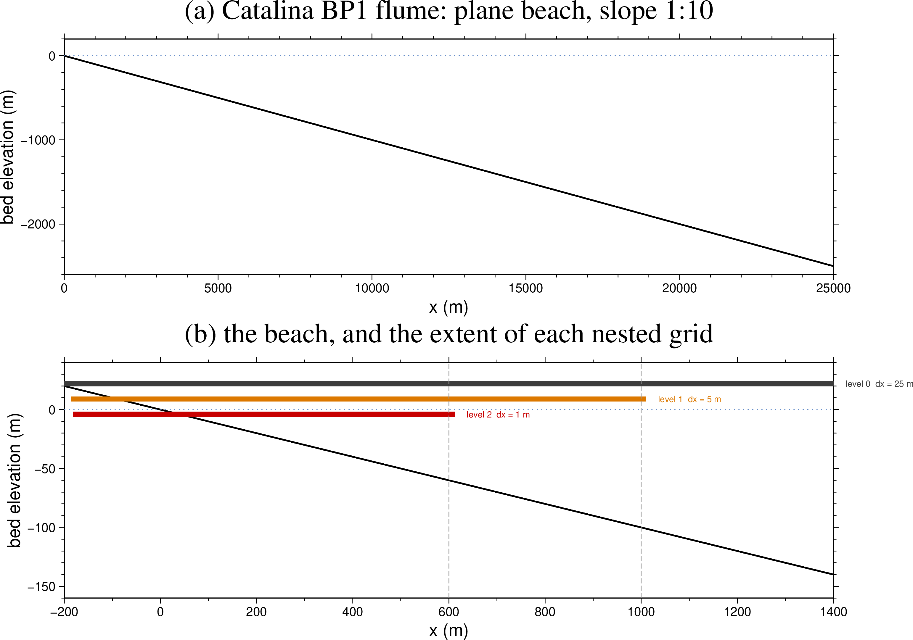
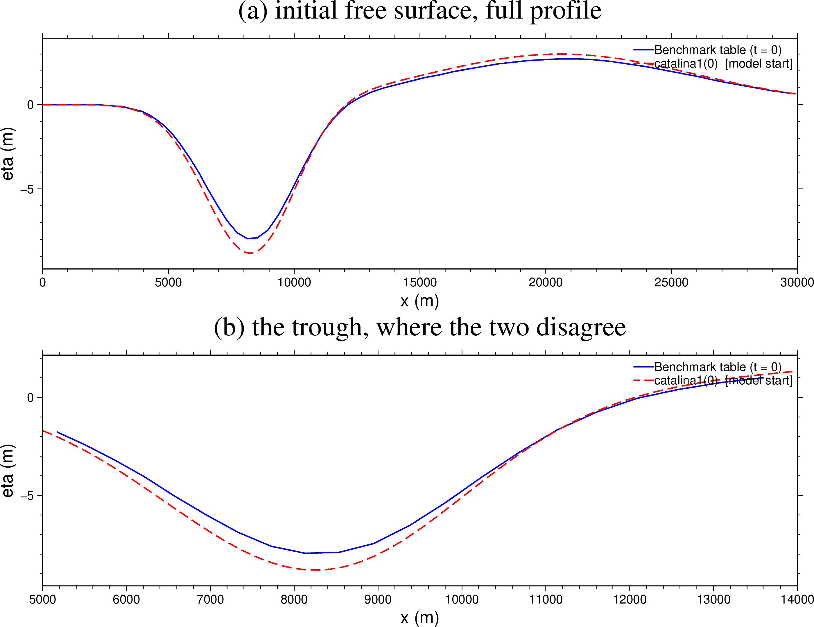
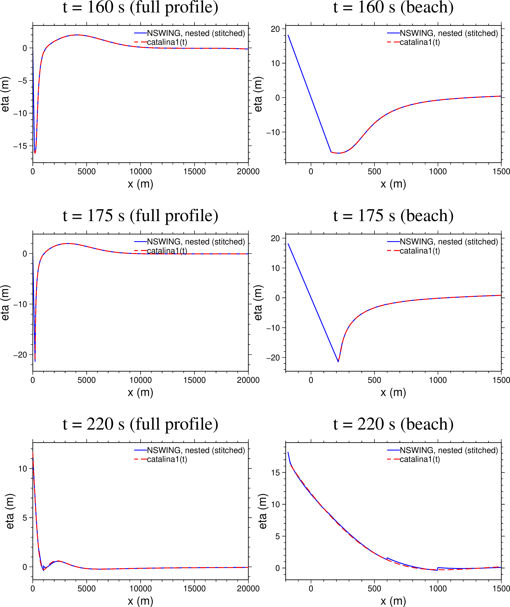
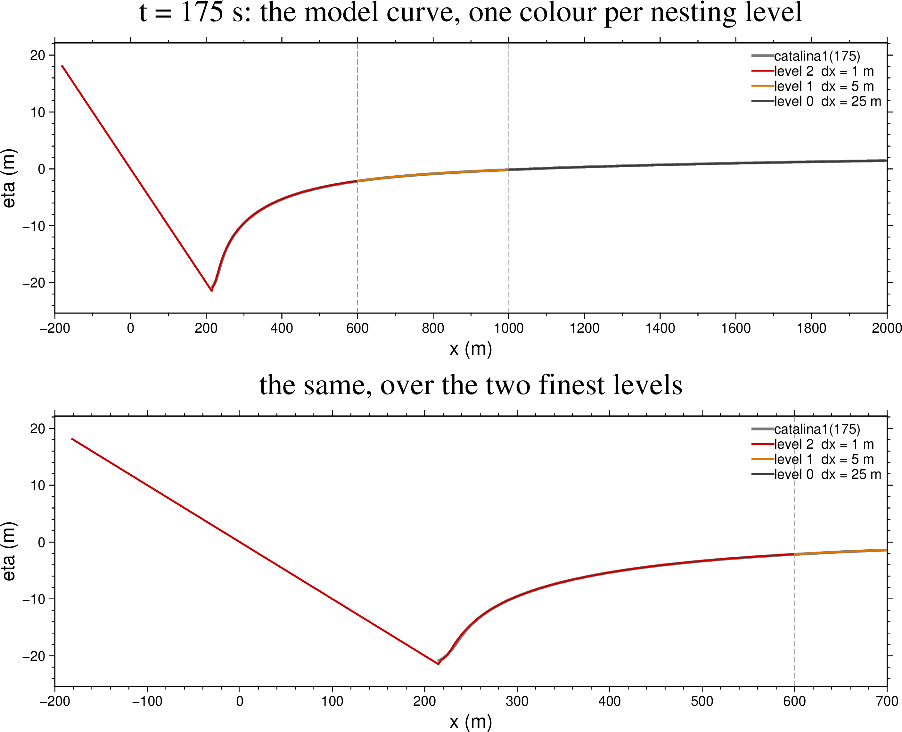
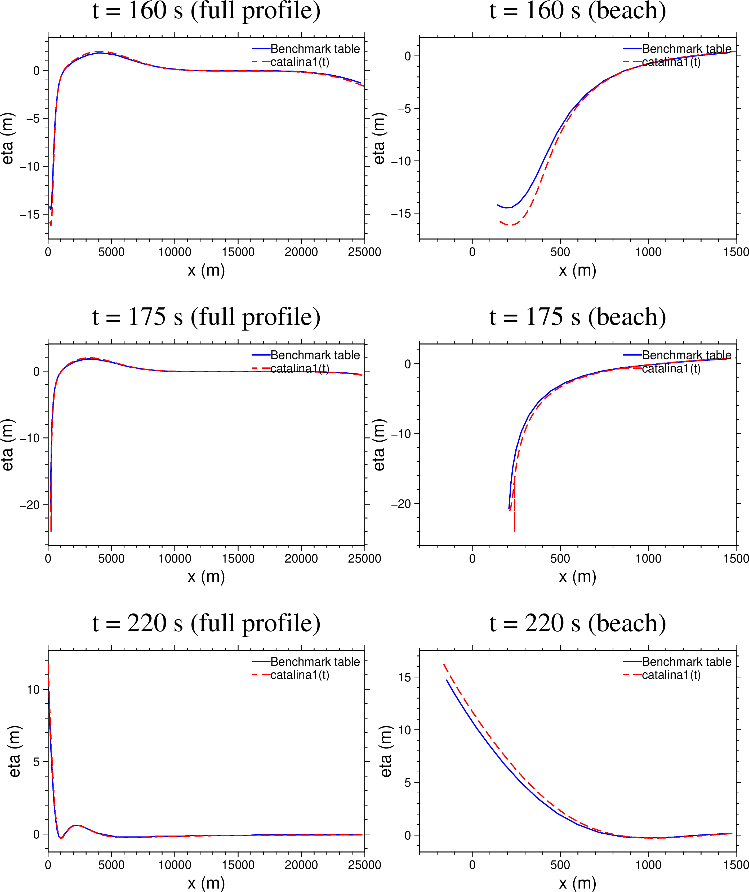
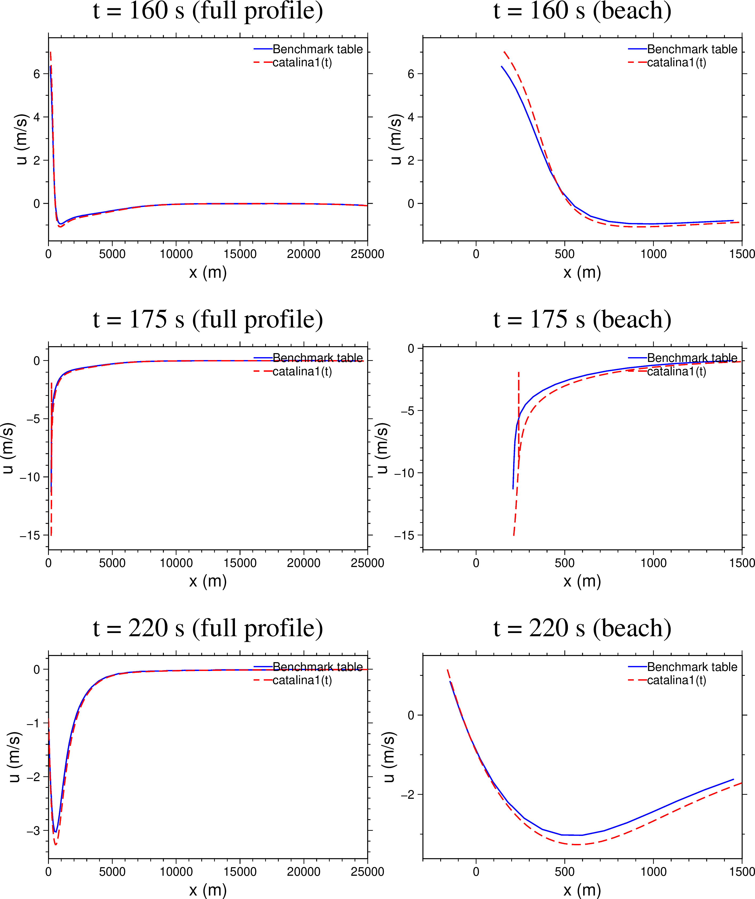

# Catalina Benchmark 1

Benchmark Problem 1 of the 2004 Catalina workshop on long-wave run-up ("Tsunami runup onto a plane
beach") is the standard analytical test for a shallow-water run-up code. iGMT ships it as a
self-contained demo: it builds the bathymetry and the initial condition, runs NSWING on three nested
grids, opens the resulting cube in the Aquamoto viewer, and draws the analytical solution on top of
the model's own η(x) profile so the two can be compared while the wave runs.

This page documents what the demo computes, how well it agrees with the published reference, and one
open defect in the analytical solver.

**Menu:** *Geophysics ▸ Tsunamis ▸ Catalina Benchmark 1*.
Every figure and every number below is produced by `examples/bm1_doc_figures.jl` — see
[Reproducing the figures](@ref bm1-repro).

## The problem

A wave runs up a plane beach of slope 1:10. Depth grows linearly offshore, so at 20 km the water is
already about 2 km deep. The benchmark's initial free surface is a closed-form pair of Gaussians,

```
eta0(x) = zscale * ( H1*exp(-c1*(x/L - x1)^2) - H2*exp(-c2*(x/L - x2)^2) )
```

with `L = 5000 m`, `zscale = L * slope = 500 m`, `H1 = 0.006`, `c1 = 0.4444`, `x1 = 4.1209`,
`H2 = 0.018`, `c2 = 4.0`, `x2 = 1.6384` — a leading depression followed by a crest, an N-wave. It is
released from rest and the reference solution is the nonlinear Carrier–Greenspan solution, published
as free-surface and velocity profiles at **t = 0, 160, 175 and 220 s**. Those four profiles are
carried verbatim in `_BM1_ANALYTIC` (`src/benchmark1.jl`), the literal of Mirone's
`testa_barnabeu.m`, and they are **the reference this demo is judged against**.

Two things happen in that time window: maximum draw-down at about t = 175 s, when the shoreline has
retreated some 220 m offshore and the surface at the shore is 21 m below datum, and maximum run-up
shortly after t = 220 s.

## The flume and the nested grids



The domain runs from x = −200 m (dry beach) to x = 50 km, with x = 0 at the initial shoreline and x
positive offshore. The whole 50 km is always simulated; only the *display* is clipped to
[−200, 20000] m, at read time, so no cropped copy is ever written to disk.

The run is three chained NSWING stages, each adding one more nest:

| level | Δx | extent | cells along x | wall time |
|-------|-----|--------|---------------|-----------|
| 0 | 25 m | −200 … 50000 m | 2009 | 5.9 s |
| 1 | 5 m | −185 … 1010 m | 240 | 7.4 s |
| 2 | 1 m | −182 … 612 m | 795 | 14.4 s |

Each stage writes its own cube (`benchmark1.nc`, `benchmark1_lev1.nc`, `benchmark1_lev2.nc`). Three
stages are needed because **with nesting NSWING writes the output cube on the finest grid only** —
one run with two nests would give a 1 m cube covering 800 m of beach and nothing else, which is not
what the window should display. Each run is 5000 cycles at Δt = 0.05 s (250 s of model time), with
output every 50 cycles, giving 101 slices 2.5 s apart; t = 160, 175 and 220 s therefore land exactly
on slices 64, 70 and 88.

The run goes past the benchmark's last tabulated time on purpose, so the wave's return down the
slope is on screen as well.

## The initial condition



The model is started from `catalina1(0)` — the analytical solution evaluated at t = 0 — not from the
table's t = 0 column, and not from the closed form above.

The reason is what the demo's comparison is *for*. The floating η(x) figure asks "does NSWING
reproduce the analytical solution?", and that question is only answerable if the model integrates the
state the analytical curve is a later snapshot of. Carrier–Greenspan's condition is posed in the
transform plane and its physical profile is displaced (`x = sigma^2/16 - eta`), so the state the
solution is actually in at t = 0 is what `catalina1(0)` returns. Starting anywhere else makes the
figure show an initial-condition mismatch dressed up as model error. Measured on the 1 m nest:

| model started from | rms vs `catalina1` at t = 160 / 175 / 220 s |
|--------------------|----------------------------------------------|
| `catalina1(0)` (current) | **0.018 / 0.046 / 0.084 m** |
| the closed form `initial_eta` | 0.28 / 0.46 / 0.21 m |
| the published table's t = 0 column | ≈ 1.3 m |

The figure above shows the price of that choice: `catalina1(0)` and the published t = 0 profile
differ by **0.287 m rms**, up to 0.835 m, almost all of it in the trough — the table's minimum is
−7.95 m at x = 8132 m where `catalina1(0)` gives −8.81 m at x = 8251 m, about 10 % deeper. That
difference is a defect in our solver, not in the table; see
[Open defect](@ref bm1-defect) below. It does not propagate into the model-vs-analytic figure,
because both sides of that comparison use the same solution.

## The model against the analytical solution



Blue is the model's stitched profile, red dashed the analytical solution at the same instant.

| t (s) | points | rms | max abs |
|-------|--------|-----|---------|
| 160 | 1282 | 0.018 m | 0.056 m |
| 175 | 1226 | 0.046 m | 0.541 m |
| 220 | 1600 | 0.084 m | 0.335 m |

Two or three centimetres of rms on a wave that reaches 21 m of draw-down and 18 m of run-up. The
largest single deviation, 0.54 m at t = 175 s, sits at the draw-down tip, which is exactly where a
shallow-water code and a Carrier–Greenspan solution should be expected to part company.

!!! note "The straight landward ramp is not water"
    Landward of the run-up point the blue curve continues as a straight line rising to +18 m at
    x = −200 m. Those are dry cells, where the cube carries the bed elevation rather than a free
    surface. They are excluded from the misfit (the analytical solution simply does not reach there,
    so nothing is compared).

## The stitched profile



The model curve is not read from one grid. Each stretch of x is taken from the finest cube that
resolves it, all at the same instant and along the same middle row:

| level | Δx | x covered | points at t = 175 s |
|-------|-----|-----------|---------------------|
| 2 | 1 m | −182 … 599 m | 782 |
| 1 | 5 m | 600 … 995 m | 80 |
| 0 | 25 m | 1000 … 20000 m | 761 |

The two hand-over points (dashed grey, at 600 and 1000 m) are set inside each nest's own useful
span — level 2 ends at 612 m and level 1 at 1010 m — so the curve never samples a grid at its
nesting boundary, where the boundary condition lives.

Reading the profile off the level-0 grid alone would sample the run-up tongue at 25 m spacing and
miss it almost entirely; the shoreline moves 220 m, so the whole feature is nine cells wide there.
Small steps of a few centimetres are visible at the hand-overs in the t = 220 s panel: that is the
genuine difference between what a 1 m, a 5 m and a 25 m grid resolve at the same place, not a
plotting artefact.

The rule deciding which level owns which x lives in exactly one function, `_bm1_level_chunks`, which
both this figure and the live window's curve are built from, so they cannot drift apart.

## [The analytical solver against the published table](@id bm1-defect)





Blue is the published benchmark table, red dashed our `catalina1(t)`. Offshore of the beach the two
agree closely; near the shore they do not.

| t (s) | η rms | η max abs | u rms | u max abs |
|-------|-------|-----------|-------|-----------|
| 0 | 0.287 m | 0.835 m | — | — |
| 160 | 0.514 m | 1.862 m | 0.221 m/s | 0.841 m/s |
| 175 | 0.729 m | 3.980 m | 1.247 m/s | 6.574 m/s |
| 220 | 0.331 m | 1.011 m | 0.082 m/s | 0.251 m/s |

!!! warning "Open defect in `benchmark1_analytic.jl`"
    **`src/benchmark1_analytic.jl` does not reproduce the published benchmark table, and it should.**
    The published table is the reference; where the two disagree the burden is on our implementation
    of the Carrier–Greenspan equations. The discrepancy is smooth and structured — a systematic
    ~10 % depth error in the trough already at t = 0, growing near the shoreline at later times — so
    it is an error in the implementation of the equations, not scatter in the reference. A better
    implementation is needed.

    Note what this means for the model comparison. The model tracks `catalina1` to 0.02–0.08 m rms,
    but measured against the *published* table the same model profile sits 0.55 / 0.78 / 0.37 m away
    at t = 160 / 175 / 220 s — essentially the solver's own error (0.51 / 0.73 / 0.33 m), inherited.
    In other words the demo currently demonstrates that **NSWING reproduces our analytical solution
    very well**; it does not yet demonstrate agreement with the published benchmark. Fixing the
    solver closes that gap without any change to the model side.

## Sign convention

The table's velocity column is positive **offshore** (the convention NSWING's U component uses);
`catalina1` returns velocity positive **shoreward**. The analytical velocity is therefore negated
before plotting. This was checked rather than assumed: cosine similarity between the two velocity
columns is −0.99 at every benchmark time.

## [Reproducing the figures](@id bm1-repro)

```
julia examples/bm1_doc_figures.jl [rundir] [outdir]
```

`rundir` is a completed three-level run (`benchmark1.nc`, `benchmark1_lev1.nc`,
`benchmark1_lev2.nc`, `benchmark1_bat.grd`); `outdir` defaults to `docs/src/assets`, i.e. straight
into this page. The script prints every misfit quoted above, so the numbers and the plots can never
disagree.

Two narrower scripts cover the table-vs-solver comparison alone:

```
julia examples/bm1_table_vs_analytic.jl [outdir]      # free surface
julia examples/bm1_table_vs_analytic_u.jl [outdir]    # velocity
```

## References

Carrier, G. F., T. T. Wu and H. Yeh (2003), Tsunami run-up and draw-down on a plane beach,
*J. Fluid Mech.*, **475**, 79–99.

Synolakis, C. E., E. N. Bernard, V. V. Titov, U. Kânoğlu and F. I. González (2007), Standards,
criteria, and procedures for NOAA evaluation of tsunami numerical models,
*NOAA Tech. Memo. OAR PMEL-135*.
