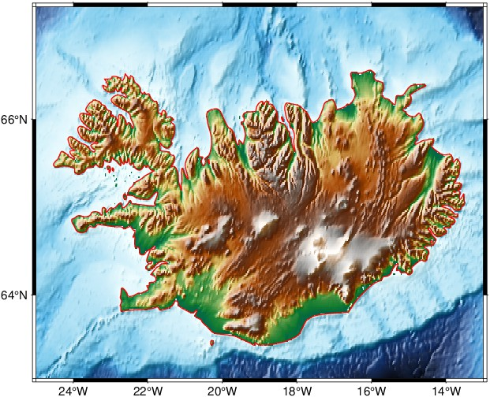
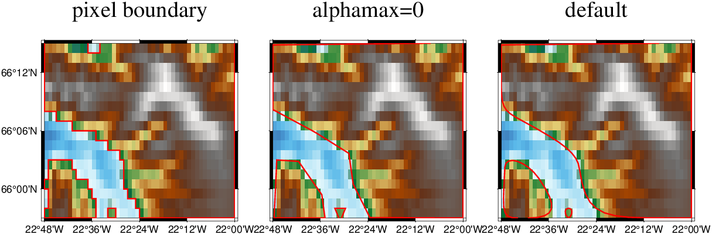
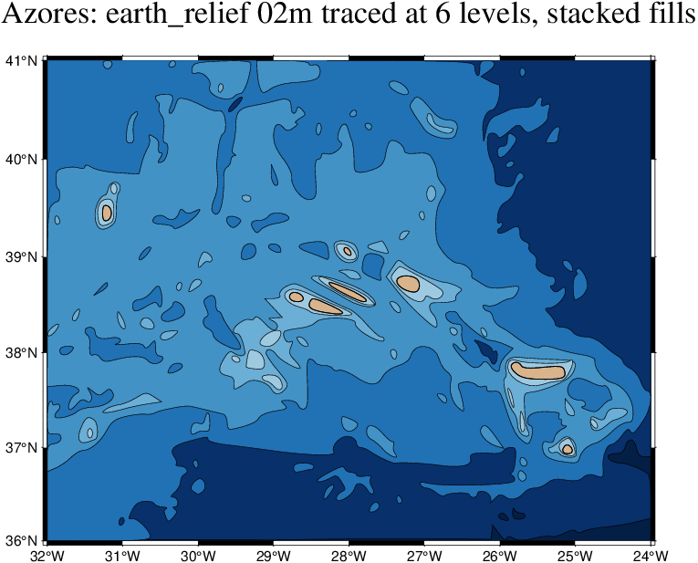
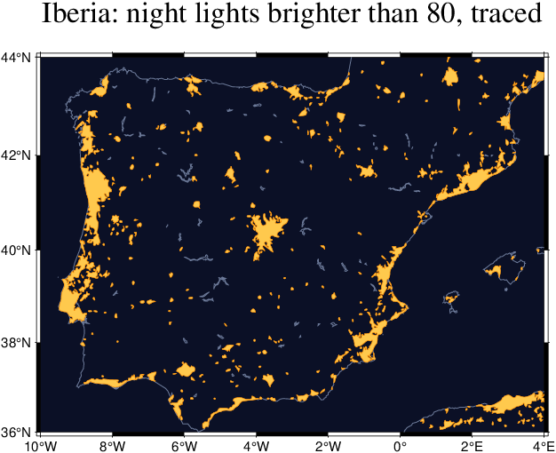
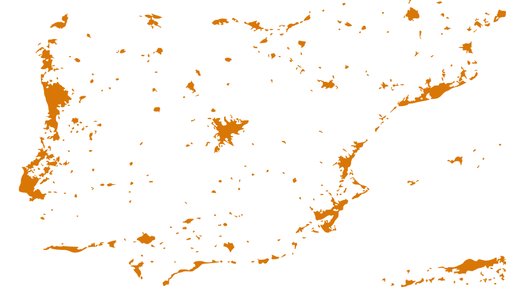

# Potrace — bitmap to vector tracing

`InteractiveGMT.Potrace` is a Julia port of the tracing core of **Potrace 1.16** by Peter Selinger
(<https://potrace.sourceforge.net>). It turns a black-and-white bitmap into smooth closed curves
(straight corners plus cubic Bézier segments), and writes them as **SVG**, **EPS**, or as a
**`Vector{GMTdataset}`** of polygons ready for GMT.jl.

Copyright (C) 2001-2019 Peter Selinger (original C). Potrace is distributed under the GNU General
Public License; this port is distributed under the same terms.

## Contents

- [How it works](#how-it-works)
- [Quick start](#quick-start)
- [API](#api)
  - [`potrace`](#potrace)
  - [`PotraceBitmap`](#potracebitmap)
  - [`PotraceParams`](#potraceparams)
  - [`PotraceResult` and `paths`](#potraceresult-and-paths)
  - [`potrace_svg`](#potrace_svg)
  - [`potrace_eps`](#potrace_eps)
  - [`potrace_gmtds`](#potrace_gmtds)
- [Coordinates](#coordinates)
- [Examples](#examples)
- [Source layout](#source-layout)
- [Verification](#verification)

## How it works

The pipeline is exactly the one described in Selinger's paper *"Potrace: a polygon-based tracing
algorithm"* (2003) and implemented in the C sources, function by function:

1. **Path decomposition** (`decompose.jl`, from `decompose.c`) — walk the boundaries between
   foreground and background pixels. Each closed boundary becomes a path with a sign: `'+'` for an
   outer boundary, `'-'` for a hole. Paths enclosing no more than `turdsize` pixels are dropped.
   The paths are arranged in a tree (a shape's holes are its children; shapes inside a hole are the
   hole's children).
2. **Optimal polygon** (`trace.jl`, `calc_lon!`, `bestpolygon!`) — find the polygon with the fewest
   edges that stays within half a pixel of the boundary, and among those the one with the least
   penalty.
3. **Vertex adjustment** (`adjust_vertices!`) — move each vertex to the point of its pixel square
   that best fits the two neighbouring edges.
4. **Smoothing** (`smooth!`) — each vertex becomes either a sharp **corner** or a **Bézier** curve,
   decided by the corner threshold `alphamax`.
5. **Curve optimization** (`opticurve!`, optional) — merge runs of Bézier segments into single
   segments when the result stays within `opttolerance`.

## Quick start

```julia
using InteractiveGMT
PT = InteractiveGMT.Potrace

M = falses(100, 140)                        # M[1,1] is the TOP-left pixel
for r = 1:100, c = 1:140
	hypot(r - 50, c - 50) < 40 && (M[r, c] = true)      # a disk ...
	hypot(r - 50, c - 50) < 15 && (M[r, c] = false)     # ... with a round hole
	(30 < r < 90 && 100 < c < 130) && (M[r, c] = true)  # and a rectangle
end

res = PT.potrace(M)
PT.potrace_svg("shapes.svg", res)
PT.potrace_eps("shapes.eps", res)
D = PT.potrace_gmtds(res)                   # Vector{GMTdataset}: 3 polygons, the hole flagged " -Ph"
```

## API

### `potrace`

```julia
res = potrace(M::Union{BitMatrix, Matrix{Bool}}; turdsize=2, turnpolicy=:minority,
              alphamax=1.0, opticurve=true, opttolerance=0.2)
res = potrace(M::Matrix{<:Real}; threshold=nothing, invert=false, <same keywords>)
res = potrace(bm::PotraceBitmap, param::PotraceParams=PotraceParams())
```

Traces a bitmap and returns a [`PotraceResult`](#potraceresult-and-paths).

- A `Bool` matrix or `BitMatrix` is used as it is: `true` is foreground (traced), `false` is
  background.
- A numeric matrix is thresholded first (see [`PotraceBitmap`](#potracebitmap)).
- The keywords are the tracing parameters (see [`PotraceParams`](#potraceparams)).

### `PotraceBitmap`

```julia
bm = PotraceBitmap(M::Union{BitMatrix, Matrix{Bool}})
bm = PotraceBitmap(M::Matrix{<:Real}; threshold=nothing, invert=false)
```

Potrace's packed 1-bit bitmap (64 pixels per word). `M` is laid out **as an image is displayed**:
`M[1,1]` is the top-left pixel and row 1 is the top row.

For a numeric matrix, pixels **below** `threshold` are foreground: dark shapes on a light page, the
way potrace reads a greymap. `invert=true` traces pixels `>= threshold` instead: light shapes on a
dark page. When `threshold` is not given, it is the midpoint of the matrix's value range.

### `PotraceParams`

```julia
PotraceParams(; turdsize=2, turnpolicy=:minority, alphamax=1.0, opticurve=true, opttolerance=0.2)
```

The defaults are those of potrace 1.16. Each keyword matches a `potrace` command-line option:

| Keyword | CLI | Meaning |
|---|---|---|
| `turdsize` | `-t` | Speckle suppression: paths enclosing at most this many pixels are dropped. `0` keeps everything. |
| `turnpolicy` | `-z` | How to resolve an ambiguous turn where two pixels touch only at a corner: `:black`, `:white`, `:left`, `:right`, `:minority`, `:majority`, `:random`. |
| `alphamax` | `-a` | Corner threshold. `0` gives a pure polygon (every vertex a corner); `1.0` is the default balance; `4/3` or more gives no corners at all. |
| `opticurve` | `-n` (off) | Merge adjacent Bézier segments when possible. `false` keeps one segment per polygon vertex. |
| `opttolerance` | `-O` | How far the merged curve may deviate. Larger means fewer segments and a looser fit. |

### `PotraceResult` and `paths`

```julia
res.w, res.h            # bitmap size in pixels
P = paths(res)          # Vector{PotracePath}, in potrace's list order
```

The list order puts every outer path immediately before its own holes. For each `p` in `P`:

| Field | Meaning |
|---|---|
| `p.sign` | `'+'` for an outer boundary, `'-'` for a hole |
| `p.area` | Pixel area enclosed by the boundary |
| `p.pt` | The raw pixel-corner boundary (`Vector` of points with integer `x`, `y`) |
| `p.fcurve` | The final curve |
| `p.childlist`, `p.sibling` | The tree: children of a positive path are its holes; children of a hole are the shapes inside it |

The final curve `cv = p.fcurve` has `cv.n` segments. The curve starts at `cv.c[cv.n, 3]`, and
segment `i` goes:

- `cv.tag[i] == Potrace.CORNER`: straight line to `cv.c[i, 2]`, then to `cv.c[i, 3]`;
- `cv.tag[i] == Potrace.CURVETO`: cubic Bézier with control points `cv.c[i, 1]`, `cv.c[i, 2]`,
  ending at `cv.c[i, 3]`.

All points are `DPt(x, y)` in pixel units (see [Coordinates](#coordinates)).

### `potrace_svg`

```julia
potrace_svg(fname::String, res; color="#000000", scale=1.0)
potrace_svg(io::IO, res; color="#000000", scale=1.0)
```

Writes SVG with one pixel = `scale` pt. Each outer path and its holes form **one** `<path>`
element. Holes run in the opposite direction to their outer path, so the default nonzero fill leaves
them open.

### `potrace_eps`

```julia
potrace_eps(fname::String, res; color="#000000", scale=1.0)
potrace_eps(io::IO, res; color="#000000", scale=1.0)
```

Writes Encapsulated PostScript with one pixel = `scale` pt, using plain `moveto`/`lineto`/`curveto`.
An outer path and the holes that follow it in the list are filled together.

### `potrace_gmtds`

```julia
D = potrace_gmtds(res; region=nothing, bezier_steps=8, proj4="", wkt="", epsg=0)
```

Returns one closed polygon per path (`geom = 3`, wkbPolygon), in list order, as a
`Vector{GMTdataset}`.

- **Holes** get the segment header `" -Ph"`, the GMT convention for a polygon hole.
- **Béziers** are flattened by sampling each segment at `bezier_steps` equal parameter steps. `8`
  is what potrace's own GeoJSON backend uses. Corners are kept exactly.
- **`region = (xmin, xmax, ymin, ymax)`** maps the bitmap onto world coordinates (see
  [Coordinates](#coordinates)).
- **`proj4` / `wkt` / `epsg`** are copied onto every dataset.

## Coordinates

Potrace works in **pixel units, y up, origin at the bottom-left corner** of the bitmap. The pixel in
display row `r`, column `c` covers the square `[c-1, c] × [h-r, h-r+1]`.

`potrace_gmtds(res; region=(xmin, xmax, ymin, ymax))` maps the rectangle `[0,w] × [0,h]` onto
`region` linearly. `region` is the extent of the **pixel edges**, not of the pixel centres:

- **Pixel-registered** raster (`registration == 1`): its `range[1:4]`, as it is.
- **Grid-registered** raster (`registration == 0`): the nodes are pixel centres, so widen the range
  by half an increment on every side:
  `(x0 - dx/2, x1 + dx/2, y0 - dy/2, y1 + dy/2)`.

## Examples

All figures below were produced by the code shown, on real GMT remote data (`@earth_relief`,
`@earth_night`). Every example uses this helper, which returns a raster's pixel-edge extent (see
[Coordinates](#coordinates)):

```julia
using GMT, InteractiveGMT
PT = InteractiveGMT.Potrace

function edge_region(G)
	x0, x1, y0, y1 = G.range[1:4]
	dx, dy = G.inc
	G.registration == 0 ? (x0 - dx/2, x1 + dx/2, y0 - dy/2, y1 + dy/2) : (x0, x1, y0, y1)
end
```

**Matrix orientation.** `potrace` wants the matrix as displayed, row 1 = north. The grids below come
back from `grdcut` in GMT.jl's `"BCB"` layout (column-major, row 1 = **south**), so each mask is
flipped with `reverse(…, dims=1)`. Check `G.layout` on your own data: a `"TRB"` grid is already
north-first but row-major in memory.

### 1. A coastline from a DEM — Iceland

The land mask is `z > 0` of `@earth_relief_01m_p` (1 arc-minute, pixel registration). The trace
gives 10 polygons: the island, 5 islets, and 4 holes flagged `" -Ph"`. The holes are patches of
`z ≤ 0` that land encloses completely at 1′ resolution (-1 to -40 m at their centres), such as
fjord heads pinched off from the sea. `turdsize=4` drops land patches of 4 cells or fewer.

```julia
G = grdcut("@earth_relief_01m_p", region=(-25, -13, 63, 67.2))     # 720 x 252, "BCB"
M = reverse(G.z .> 0, dims=1)                                       # land, row 1 = north
res = PT.potrace(M; turdsize=4)
D = PT.potrace_gmtds(res; region=edge_region(G), proj4="+proj=longlat +datum=WGS84")

grdimage(G, cmap=:geo, shade=true, proj=:merc, figsize=12, frame=(axes=:WSen, annot=:auto))
plot!(D, pen=(0.6, :red), savefig="iceland.jpg", dpi=120)
```



Use `cmap=:geo` as it is. A `makecpt(cmap=:geo, range=…)` with an asymmetric range moves the
colours off the 0 m hinge, and low land then looks like sea under a correct coastline.

### 2. What the parameters do — a Westfjords close-up

This is the same data cut to 48 × 18 cells, so the pixels are visible. The three panels show:

- **pixel boundary**: the raw path, taken from `p.pt`;
- **`alphamax=0`**: every vertex a corner, so you see the optimal polygon;
- **default**: corners where the outline really turns, Béziers elsewhere, merged by the curve
  optimization.

`turdsize=0` keeps even single-cell islands.

```julia
Gz = grdcut("@earth_relief_01m_p", region=(-22.8, -22.0, 65.95, 66.25))
Mz = reverse(Gz.z .> 0, dims=1)
rz = edge_region(Gz)

# the raw pixel-edge boundary of each path, as polygons
function raw_ds(res, reg)
	x0, x1, y0, y1 = reg
	sx, sy = (x1 - x0) / res.w, (y1 - y0) / res.h
	[GMTdataset{Float64,2}(data=[x0 .+ sx .* [q.x for q in [p.pt; p.pt[1]]]  y0 .+ sy .* [q.y for q in [p.pt; p.pt[1]]]],
	                       geom=3, header=(p.sign == '-' ? " -Ph" : "")) for p in PT.paths(res)]
end
raw  = raw_ds(PT.potrace(Mz; turdsize=0), rz)
poly = PT.potrace_gmtds(PT.potrace(Mz; turdsize=0, alphamax=0.0); region=rz)
curv = PT.potrace_gmtds(PT.potrace(Mz; turdsize=0); region=rz)

Cz = makecpt(cmap=:geo, range=(-300, 1000), continuous=true)
opts = (cmap=Cz, proj=:merc, figsize=5.5, xaxis=(annot=0.2,), yaxis=(annot=0.1,))
grdimage(Gz;  opts..., frame=(axes=:WSen, title="pixel boundary"))
plot!(raw,  pen=(1.0, :red))
grdimage!(Gz; opts..., frame=(axes=:wSen, title="alphamax=0"), xshift=6.6)
plot!(poly, pen=(1.0, :red))
grdimage!(Gz; opts..., frame=(axes=:wSen, title="default"), xshift=6.6)
plot!(curv, pen=(1.0, :red), savefig="smoothing.png", dpi=150)
```



### 3. Stacked levels — a vector hypsometric map of the Azores

Tracing `z > L` for a series of levels and filling the results from the deepest up gives a filled
contour map made only of vector polygons. The same stacking of one mask per class is how colour
images are vectorized. Holes are what make it work: a deep basin inside the `-2000` layer is a
`" -Ph"` hole, so the colour of the layer below shows through.

```julia
Ga = grdcut("@earth_relief_02m_p", region=(-32, -24, 36, 41))       # 240 x 150
levels = [-4000, -3000, -2000, -1000, -500, 0]
colors = ["#08306b", "#2171b5", "#4292c6", "#6baed6", "#9ecae1", "#d9b38c"]   # fill above each level
layers = [PT.potrace_gmtds(PT.potrace(reverse(Ga.z .> L, dims=1); turdsize=4); region=edge_region(Ga))
          for L in levels]
# polygons per layer: [3, 17, 36, 33, 16, 8], of which holes: [2, 3, 18, 0, 0, 0]

basemap(region=Ga.range[1:4], proj=:merc, figsize=14,
        frame=(axes=:WSen, annot=:auto, fill="#041f45", title="Azores: earth_relief 02m traced at 6 levels, stacked fills"))
for (k, l) in enumerate(layers)
	plot!(l, fill=colors[k], pen=(0.25, "#00000040"))
end
plot!(layers[end], pen=(0.5, :black), savefig="azores_levels.png", dpi=120)
```



### 4. Tracing an image — night lights of Iberia, to GMT and to SVG

`@earth_night_01m_p` is an RGB image. `gmtread` returns it in the `"BRPa"` layout: pixel-interleaved,
band fastest, then x, then rows from the north. The luminance is built straight into the display
layout, then thresholded with `invert=true`, because the bright pixels are the ones to trace.
The trace gives 333 polygons.

```julia
I = gmtread("@earth_night_01m_p", region=(-10, 4, 36, 44))          # 840 x 480 x 3, "BRPa"
P = reshape(I.image, 3, 840, 480)                                    # band, x, row-from-north
L = [(Int(P[1,c,r]) + Int(P[2,c,r]) + Int(P[3,c,r])) / 3 for r = 1:480, c = 1:840]

res = PT.potrace(L; threshold=80, invert=true, turdsize=6)          # lights brighter than 80
D = PT.potrace_gmtds(res; region=edge_region(I))

basemap(region=I.range[1:4], proj=:merc, figsize=12,
        frame=(axes=:WSen, annot=:auto, fill="#0b1026", title="Iberia: night lights brighter than 80, traced"))
coast!(shore=(0.4, "#6c7a99"))
plot!(D, fill="#ffc94d", pen=(0.2, "#ff8c00"), savefig="iberia_lights.png", dpi=120)

PT.potrace_svg("iberia_lights.svg", res; color="#d97706")           # the same trace as SVG
```



The SVG written by `potrace_svg`, unedited (one pixel = 1 pt, 137 kB):



### 5. Parameters on a synthetic shape

```julia
M = falses(80, 120)
for r = 1:80, c = 1:120
	(hypot(r - 40, c - 40) < 30) && (M[r, c] = true)         # a disk
	(20 < r < 60 && 75 < c < 110) && (M[r, c] = true)        # a square
end

smooth  = PT.potrace(M)                                  # defaults: curves + optimization
polygon = PT.potrace(M; alphamax=0.0)                    # corners only
raw     = PT.potrace(M; opticurve=false)                 # one segment per polygon vertex

for (name, r) in (("smooth", smooth), ("polygon", polygon), ("raw", raw))
	println(name, ": ", [(p.fcurve.n, count(==(PT.CORNER), p.fcurve.tag)) for p in PT.paths(r)])
end
# (segments, corners) per shape, disk first:
# smooth:  [(8, 0), (4, 4)]    the disk is 8 Béziers, the square keeps its 4 corners
# polygon: [(17, 17), (4, 4)]  the disk becomes a 17-gon
# raw:     [(17, 0), (4, 4)]   17 Béziers, one per polygon vertex, not merged
```

### 6. EPS, and output into memory

```julia
PT.potrace_eps("iberia_lights.eps", res; color="#aa0000", scale=0.5)   # half a pt per pixel
io = IOBuffer(); PT.potrace_svg(io, res); svg = String(take!(io))
```

### 7. Walking the curves yourself

```julia
res = PT.potrace(M)
for p in PT.paths(res)
	cv = p.fcurve
	start = cv.c[cv.n, 3]
	println(p.sign == '+' ? "outer" : "hole ", "  start=(", start.x, ", ", start.y, ")  segments=", cv.n)
	for i = 1:cv.n
		if cv.tag[i] == PT.CORNER
			# line to cv.c[i,2], then to cv.c[i,3]
		else
			# Bézier: controls cv.c[i,1], cv.c[i,2]; end cv.c[i,3]
		end
	end
end
```

## Source layout

| File | Contents | C origin |
|---|---|---|
| `Potrace.jl` | The module, exports | — |
| `types.jl` | Parameters, points, packed bitmap, curve/path structs, list hooks | `potracelib.h`, `auxiliary.h`, `bitmap.h`, `curve.h/.c`, `lists.h` |
| `decompose.jl` | Bitmap → signed paths → tree | `decompose.c` |
| `trace.jl` | Paths → polygon → curves; `potrace()` | `trace.c`, `potracelib.c` |
| `output.jl` | SVG, EPS and GMTdataset writers | new, geometry as the C backends |

Not ported: the command-line frontend (`main.c`, `getopt`, file readers, `mkbitmap`, progress bars)
and the C backends.

## Verification

The port was checked against the original `potrace.exe` 1.16. The same bitmap was piped to the
executable as a PBM (`potrace -b geojson -u 1000`) and its rings were compared with
`potrace_gmtds`, which by default samples each Bézier at 8 steps exactly like that backend. The test
set was:

- 6 bitmap sizes, including widths below, equal to and above the 64-bit word;
- all 7 turn policies;
- `-n`, `-a 0`, `-a 1.3334`, `-t 0`, `-t 20` and `-O 1`;
- pure random noise.

Every ring matched, to the executable's 3 printed decimals. The unit tests in
`test/test-potrace-unit.jl` pin reference rings taken from the executable.
